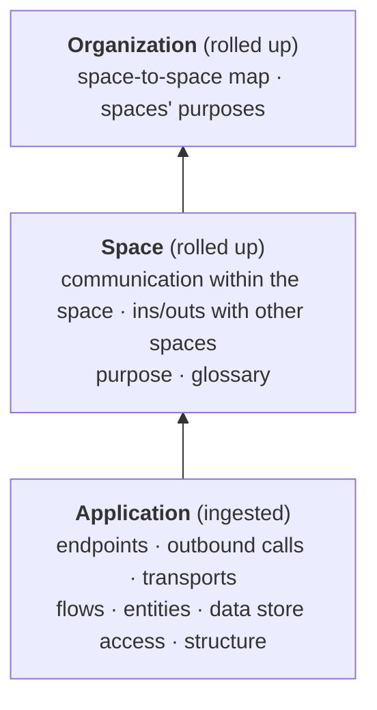
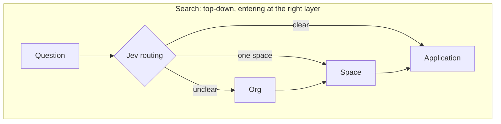
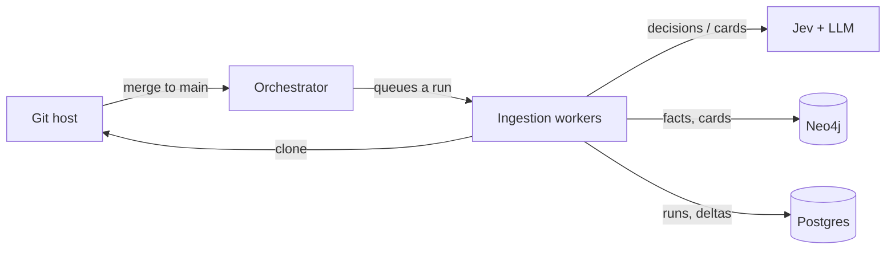
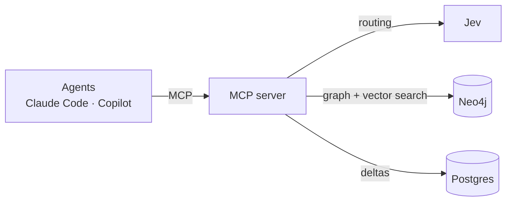
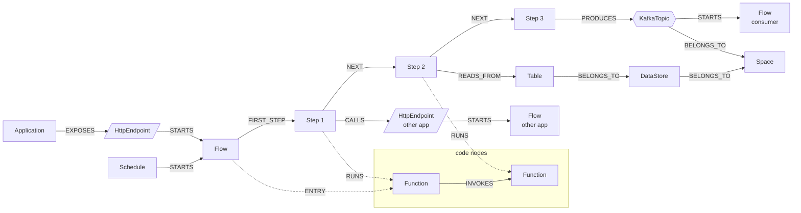
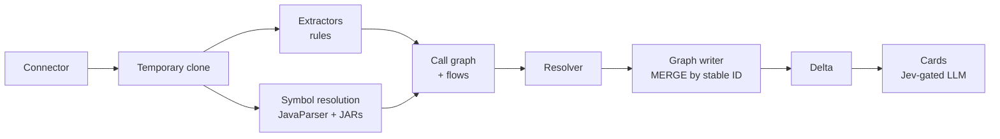
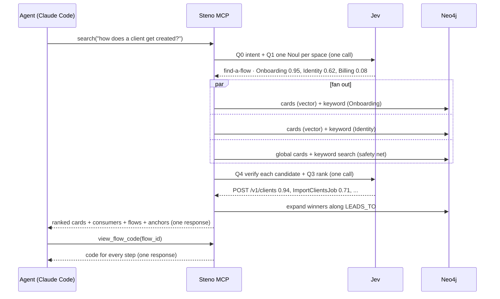
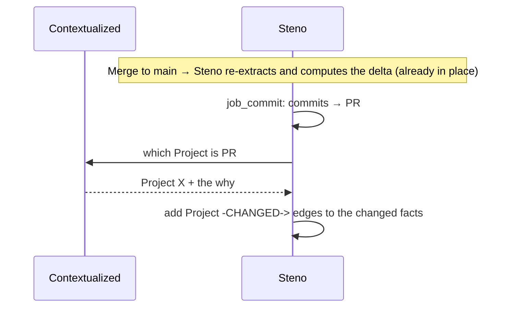

# Steno Design Doc

| | |
|---|---|
| **Status** | Draft v0.1 |
| **Author** | Kellen Bavis |
| **Last updated** | 2026-09-27 |
| **Detailed docs** | [Knowledge Graph](./knowledge-graph.md) · [Ingestion](./ingestion.md) · [Extractor Rules](./extractor-rules.md) · [Retrieval & MCP](./retrieval-and-mcp.md) · [Jev](./jev.md) · [Use Cases](./use-cases.md) |

Status markers used throughout: **Decided** · **Proposed** (suggested, not yet confirmed) · **Open** (not yet decided).

---

## 1. Summary

Steno is an **organization-wide context engine for agents**. It ingests an organization's repositories into a **layered knowledge graph** (Organization → Space → Application) and exposes it over **MCP**. Agents such as Claude Code and Copilot can then answer questions about **how everything fits together**: what exists, how it communicates, which flows run through it, and what a change will affect.

Key design choices:

- **Built bottom-up, searched top-down.** Applications are ingested first, and space and org views are **rollups** of application facts. Queries start at the highest layer the question needs.
- **Deterministic first.** Rules extract facts. **Jev** makes typed, calibrated decisions where rules can't. An **LLM only writes** summaries.
- **Agnostic core, org-specific rules.** Connectors reach sources, and extractors are declarative rules that any org can extend.
- **Fast by design.** Precomputed cards, routing to the right layer, server-side fan-out, and batch tools minimize agent round trips.
- **Idempotent and incremental.** A one-time initial ingestion, then updates driven by commit ranges on every merge to main.

---

## 2. Problem

Agents are strong within one repository and blind beyond it. In a large enterprise, most of what matters for a change lives **outside** the repo: who consumes this topic, which flows cross this service, which space owns this data. Today that knowledge lives in people's heads and stale docs.

**[Contextualized](https://github.com/KBavis/contextualized)** (my per-project context tool) showed that packaging context behind MCP tools works:
- An organization can add **all of its Projects** to it.
- The context each Project gives an agent is **scoped to the exact changes that Project introduced**: its diffs, tickets, and summary.
- That provides the idea of **incremental change tied to an originating Project**. Anyone can look at what a Project did and why.

**But more context is needed.** Contextualized knows what a Project changed, not how those changes fit into the rest of the landscape: what else exists, who depends on it, and how it all connects. Steno supplies that view. Its scale (a whole organization, not one Project's changes) needs a different storage and retrieval design than Contextualized's relational DB plus vector chunks. The two are complementary: Contextualized says *what a Project changed and why*, and Steno says *what that change touched across the org* (see [§15](#15-contextualized-integration-deferred)).

## 3. Goals and non-goals

**Goals**

1. Let an agent **understand one application in depth**: endpoints, outbound calls, transports, flows, entities, and code structure.
2. **Roll up** to space and organization views: communication within and between spaces, and each space's purpose and glossary.
3. **Answer quickly**, in ≤ 3 tool calls for typical questions (see [latency targets](./retrieval-and-mcp.md#6-latency-targets-proposed)).
4. **Stay current** through incremental updates on merge to main.
5. **Work at any org**, without hard-coding one company's structure or tools.
6. **Show confidence and provenance** for every fact.

**Non-goals (for now)**

- Building the tools that *use* the context (test generators, CI bots). Agents and workflows build those on top. See [Use Cases → Scope boundary](./use-cases.md#scope-boundary).
- Runtime observation (Splunk, OpenTelemetry). Phase 1 is static only.
- Full data store schema introspection (V2).
- Version history and time travel, beyond the delta store.
- Capturing the "why" behind facts. That arrives with the Contextualized integration.

## 4. Scope and target

- **Target scale:** a large enterprise, with thousands of repositories and many spaces.
- **Phase 1 targets:** first **[Contextualized](https://github.com/KBavis/contextualized)** (public; Python, FastAPI, SQLAlchemy), which the author knows well enough to judge the graph by eye and which proves the design isn't tied to one language. Then one application in our own org (Spring Boot, Kafka, Bitbucket).
- **Languages: multi-language by design.** Python comes first (Contextualized), then Java, which most of our org uses. Nothing in the graph model, pipeline, or MCP tools is Java-specific: each additional language needs extractor rule packs (ast-grep / Semgrep support many languages) and its own symbol resolver.

---

## 5. Core concepts

### 5.1 Layers

| Layer | What it is |
|---|---|
| **Organization** | The whole org, made up of spaces |
| **Space** | A generic name for however an org divides itself. It can nest, or an org can have only one. Owns data stores and topics. |
| **Application** | An independently deployable unit. One repository can contain several (e.g. our microservices repo). |

These three layers are the levels of zoom. Beneath them, the graph holds two kinds of nodes in **one database**: **architecture nodes** (Application → Flow → Step, interfaces, tables, …: what the software does) and **code nodes** (Repository → Module → File → Function: how it's built), joined by `BUILT_FROM`, `ENTRY`, and `RUNS`. The test for which is which: if a behavior-preserving refactor would change the node, it's a code node. Search runs only on architecture nodes. See [Knowledge Graph §2](./knowledge-graph.md#2-one-graph-layers-architecture-nodes-and-code-nodes). Project is **not** a layer. Projects attach to facts as attribution, later, through Contextualized.

### 5.2 Built bottom-up, searched top-down

**Build: understand each application fully, then roll up.** Ingestion derives everything important about an application. Each layer above is computed from the layer below it.

**Facts are stored only at the lowest level.** Everything above is derived, so there's one source of truth.

### 5.3 Who does what

| Work | Done by | When |
|---|---|---|
| Extracting facts | Deterministic rules (extractors) | Ingestion |
| Decisions: classify, route, verify, gate, score | **Jev**, Steno's navigator | Ingestion and query |
| Writing cards, flow summaries, glossary definitions | LLM: a stronger model for flow, app, and space cards; a small one for the rest | Ingestion only |
| Reasoning and the final answer | The client's LLM | Query |

---

## 6. Architecture

Steno has two independent paths that share the same two databases.

**Write path: ingestion** (runs in the background, heavy)

**Read path: queries** (interactive, fast)

The UI (later) talks to an Admin API for connectors and runs, and uses the same read path as agents.

| Component | Responsibility |
|---|---|
| **MCP server** | Tools for agents. Stateless, reads Neo4j and Postgres, calls Jev for routing. |
| **Admin / Onboarding API** | Connectors, extractors, space declarations, run status. Backs the UI. |
| **Orchestrator** | Turns webhooks, schedules, and manual requests into ingestion runs. Tracks `last_ingested_sha`. |
| **Ingestion workers** | Execute ingestion runs: clone, extract, resolve, derive flows, write facts, compute deltas, generate cards. They're separate from the MCP server so heavy work never slows queries, and several can run in parallel. In the POC, one process can play both orchestrator and worker. |
| **Neo4j** | The knowledge graph, summary cards, and the vector index |
| **Postgres** | Application state: connectors, extractor registry, runs, deltas, Jev and LLM logs |

---

## 7. Technology choices

| Area | Choice | Why | Status |
|---|---|---|---|
| Knowledge graph | **Neo4j** | An organization's architecture **is** a graph: entities (applications, interfaces, flows, data stores) as nodes, and dependencies and interactions as edges. A graph database stores it the way it's naturally modeled and queried, handles paths of variable length (a flow chain across 10+ services), and has a built-in vector index. | Decided (leaning); **Open**: edition/licensing |
| Application state | **Postgres** | Relational data: connectors, runs, deltas, logs | Decided |
| Code-pattern rules | **ast-grep / Semgrep** YAML rules (tree-sitter based) | Declarative, many languages, orgs can write their own | Decided |
| Config rules | YAML / properties path rules | Kafka topics, URLs, and placeholders are in config | Decided |
| Symbol resolution | **Our own, per language.** Java: JavaParser symbol solver + dependency JARs, run as a JVM helper. Python: a small resolver on tree-sitter. | Resolves calls, including through library types, without a full build | Decided (**SCIP not planned**) |
| DI resolution | Per-framework rule plugins (Spring first) + Jev I1 | The compiler can't know which bean gets injected | Decided |
| Source access | **git clone** into temporary workspaces | Full source for resolution, rate limits, exact diffs | Decided |
| Code access | Git host API at the ingested commit, with an in-memory cache. **No stored file contents.** | Simplest; code always matches the graph | Decided |
| Decisions | **Jev** (TypeSafe) | Typed, calibrated, fast, cheap decisions | Decided |
| Writing | **LLM purpose + narrative for every flow**; LLM cards for apps, spaces, org; deterministic cards for the rest. Small model by default, Batch API, prompt caching. Model picked after the dry run. | Flow cards decide whether flows can be found | Proposed; **Open**: model, after the dry run |
| Embeddings | **Stored in Neo4j's vector index** (no separate vector DB); model TBD | One store: vector search and graph traversal in the same query | Decided (storage); **Open**: model |
| Keyword search | Neo4j full-text index | Exact names: paths, topics, symbols | Decided |
| Agent interface | **MCP** over Streamable HTTP | Works with Claude Code, Copilot, and custom agents | Decided |
| Schema replay (V2) | Testcontainers | Replay migrations into a temporary DB, then read its catalog | Proposed (V2) |
| Steno's implementation language | **Python** (leaning) | Official MCP SDK, Neo4j driver, tree-sitter / ast-grep bindings, Anthropic SDK, LiteLLM; familiar from Contextualized. JavaParser runs as a small JVM helper. | Leaning |
| UI | **Next.js / React** (leaning; a chance to learn TypeScript). React Flow + ELK.js for the flow tracer; Cytoscape.js or Sigma.js for the org map | | Leaning (later) |

---

## 8. Knowledge graph

Full model: [knowledge-graph.md](./knowledge-graph.md).

- **Three independent aspects per node:**
  - **Labels**: what it is, e.g. `(:Interface:KafkaTopic)`.
  - **One `BELONGS_TO` edge**: where it lives.
  - **Interaction edges**: what it does.
- **No `IS_A` edges.** Neo4j labels handle abstraction.
- **Nodes:** `Organization`, `Space`, `Repository`, `Application`, `Module` (roles: `:Service`, `:Library`, `:Contract`, `:Migrations`, `:Test`, `:Build`), `File`, `Function`, `Interface` (`:HttpEndpoint`, `:GrpcMethod`, `:KafkaTopic`, `:Queue`, plugin-defined), `Schedule`, `Flow`, `DataStore` (category labels: `:Relational`, `:Document`, …; vendor as a property), `Schema`, `Table`, `Column`, `Entity`, `ExternalSystem`, `KafkaCluster`.
- **Key edges:** `INVOKES {seq}` (code calls code), `CALLS` (code calls over the network), `PRODUCES`, `CONSUMES`, `READS_FROM`, `WRITES_TO`, `STARTS` (what kicks off a flow), `LEADS_TO` (one flow causes another; **derived**), `EXPOSES`, `BUILT_FROM`, `DEPENDS_ON` (build dependency), `MAPS_TO` (entity → table). Every edge is either extracted from code/config or derived from other edges; see [Relationship types](./knowledge-graph.md#4-relationship-types).
- **Flows:**
  - A flow is a **unit of work** started by a trigger (an interface or a schedule). There is no Job type and no Subflow type.
  - Every first-party function reachable from an entry point is stored.
  - `significant` and `utility` are **derived tags**, not filters.
  - Steps are an **ordered tree** (by call-site `seq`).
  - A flow points to another flow across an interface (sync: waits; async: fire and forget) and **never contains it**.
- **Internal vs. external** is derived from the lowest common ancestor in the tree.
- **Stubs** are placeholders for targets that aren't ingested yet, and merge with the real node by stable ID.
- **Data stores:** V1 records entity → table mappings and table-level reads/writes, with stub tables. V2 adds columns, constraints, and purpose.

Solid edges connect **architecture nodes**: the Flow, its Steps in order, and what each step touches. Dashed edges lead into the **code nodes** (the boxed group), which are only visited for fine detail.

---

## 9. Ingestion

Full design: [ingestion.md](./ingestion.md).

- **Connectors** are a source system plus a scope (a Bitbucket workspace or project, a GitHub org), with credentials stored as references into a secret manager. Repositories are selected separately: an explicit include list in Phase 1, discovery later.
- **Extractors** are rules ("when you see X, emit Y"): an ast-grep pattern plus what it means in Steno's vocabulary (nodes, edges, clues, entry points), config path rules, or code plugins. They match **file types and patterns, not connectors**. Orgs add their own. Full format: [Extractor Rules](./extractor-rules.md).
  - Published as versioned **rule packs** (~40–60 rules for a Spring/Kafka stack), auto-enabled from build dependencies.
  - A **coverage report** after every ingestion ranks what no rule explained, which points straight at the internal frameworks worth a rule.
  - **Phase 1 is fully deterministic:** a person writes each rule, by hand or with the `rule-pack-author` skill, and every rule ships with test cases. Steno generating rules itself (templates, LLM drafting) is a future enhancement.
- **Cloning** into a temporary workspace gives resolution the full source, avoids rate limits, and makes `git diff` exact. 
- **Config files** become facts (topics, clusters, base URLs, datasources, schedules), plus a property map for placeholders.
- **Resolution:**
  - Symbols: Steno's own (JavaParser symbol solver + dependency JARs). SCIP is not planned.
  - DI: framework rules, then Jev I1.
  - Config placeholders are resolved. Secret values are never ingested.
- **Passes:**
  1. Per file.
  2. Whole app (call graph → all flows at once).
  3. Resolve.
  4. Write.
- **Idempotency:** stable IDs from natural keys. Re-ingesting a scope replaces its facts. Shared nodes are removed only when nothing references them.
- **Incremental updates:**
  - Triggered by a merge to main.
  - Diff by **commit range** from `last_ingested_sha`.
  - Re-extract the changed files, then re-derive only the flows that reach changed functions.
  - Map commits to PRs for attribution.
- **Steno owns re-ingestion.** Contextualized will add attribution and the "why."

### Relational database

Postgres holds what Steno is told and what it did; Neo4j holds what it knows. Tables: configuration (`organization`, `connector`, `repository`, `space`, `glossary_term`, `rule_pack`, `repository_rule_pack`), operations (`ingestion_job`, which is also the work queue, `ingestion_stage`, `coverage_item`), change history (`fact_change`, `job_commit`), and audit/cost (`llm_call`, `llm_output`, `jev_decision`, `tool_call`). See the [ER diagram](./ingestion.md#8-relational-database-postgres).

---

## 10. Retrieval and MCP

Full design: [retrieval-and-mcp.md](./retrieval-and-mcp.md).

- **Round trips dominate latency**, so the design minimizes calls:
  - precomputed **cards** (flows, apps, spaces, the org, interfaces, entities, tables)
  - **Jev routing** to the right layer
  - **parallel fan-out on the server** across spaces
  - progressive disclosure
  - batch tools
  - token budgets
- **Search, with Jev as the navigator:**
  1. Jev Q0 (what kind of question?), Q1 (which spaces?), Q2 (which app?).
  2. **Candidates from four signals**, in parallel per scope:
     - vector search over **flow cards**
     - **keyword** (full-text index)
     - *(deferred)* **entity anchors**: the question's nouns → `Entity` / `Table` nodes, and its verb → an operation
     - **glossary** expansion
  3. **Jev Q4 verifies each candidate** ("does this flow do what was asked?"), and Q3 ranks and trims.
  4. The winners are expanded along `LEADS_TO`.

  The client's LLM synthesizes the answer. Steno runs no LLM at query time. Recall over precision: 5–10 verified candidates with confidence.
- **Code access:** Steno stores **no file contents**. `view_flow_code` fetches a whole flow's code in one call, and `view_file` / `list_directory` cover everything else, all from the git host at the ingested commit.
- **Citations (V1):** every result cites where each claim comes from (space, app, repo, module, file, lines, commit, plus a link), and lists the scopes that were searched.
- **Jev never decides alone:** a global vector and keyword search runs in parallel with Jev routing as a safety net. Routing is soft when confidences are close, and every Jev decision can be switched off.
- **Tools:** `search`, `get_node` (its Space view is the "Bloomberg" ins/outs), `glossary`, `get_flow`, `view_flow_code`, `view_file`, `list_directory`, `find_symbols`, `find_dependents`, `find_paths`, `analyze_change` (takes PRs, collects related PRs, and runs a dry-run ingestion into a temporary overlay), `get_interface`, `get_changes`.
- **Latency targets (Proposed):** graph tools p95 < 300 ms; `search` p95 < 1.5 s; ≤ 3 calls per typical question.

---

## 11. Jev

Full design: [jev.md](./jev.md). **Decided:** Jev makes every decision that deterministic rules can't. The specific decisions below are Decided unless marked deferred.

- **Ingestion:**
  - I1: DI candidate
  - I2: transport of an unrecognized call
  - I3: unrecognized entry point
  - I4: org host vs. vendor
  - I5: is a flow's purpose and narrative still accurate after a change (controls LLM cost)
  - I8: is an unexplained call worth the coverage report
  - I10: business flow or technical plumbing (health checks rank lower)
  - *Deferred / not planned:* I6 space proposals (admins define spaces), I7 glossary mapping (the glossary is human-declared), I9 entity + operation tags (entity anchors)
- **Query:**
  - Q0: what kind of question
  - Q1: which spaces (one Noul per space, in one call)
  - Q2: which app
  - **Q4: does each candidate flow do what was asked** (verification)
  - Q3: relevance score
- **Guided navigation of the large graph (N1–N5):** routing down the tree as a beam search, best-first expansion when a traversal fans out, deciding when the server should stop or go one level deeper, disambiguating similar names, and choosing how much detail to return.
- **Never alone:** a global vector and keyword search runs in parallel with routing, routing is soft when confidences are close, and every Jev decision can be switched off.
- **What Jev sees:** bounded **digests** built from the graph (a flow digest is its trigger, card, and interactions, ~300–600 tokens however big the flow is), never raw code. That keeps every call within Jev's ~64k input budget.
- **Why it matters:** each of these would otherwise be a slow LLM call. With Jev, one `search` costs three rounds of Jev calls, ~0.2–1.5 s.
- **Confidence bands:** > 0.9 act · 0.5–0.9 act and mark low-confidence · < 0.5 mark ambiguous or ask a human.
- **Safeguards:** every decision is logged so calibration can be measured, and a `Decision` interface keeps Jev replaceable.

---

## 12. LLM usage and cost

- The LLM **writes** cards, flow summaries, and glossary definitions. It also drafts rules on request (optional, rare). Nothing else.
- **Every flow gets an LLM-written purpose and narrative** at initial ingestion, on top of its deterministic signature. Apps, spaces, and the org get LLM cards. Interfaces, entities, and tables get deterministic cards. Functions get none.
- **Levers for scale:** a small model by default, the Batch API, and prompt caching (flows in one app share a cached prefix). On re-ingestion, Jev I5 decides whether a flow's purpose and narrative are still accurate before anything is regenerated.
- Cards are properties on their node, with one vector index across all of them (`:Searchable`).
- Output is cached by the hash of its inputs, and regenerated only when Jev I5 says the meaning changed. Batch API where possible (50% cheaper).
- **Cost and time are measured before any LLM spend:** Phase 1 begins with a dry run (deterministic ingestion only) that reports time per stage, graph size, and the **projected** LLM cost per strategy. Whether LLM cards are worth it at org scale is decided from those numbers (see [Retrieval](./retrieval-and-mcp.md#cost-and-time-measure-before-generating-decided)).
- Every call is logged (`llm_call`) and its text cached (`llm_output`), so the cost per app is measured, not guessed, and unchanged inputs are never paid for twice.

---

## 13. Onboarding an organization

**Passive by default. Nothing is required of applications.**

| Level | What the org does | What Steno gets |
|---|---|---|
| **Passive** (default) | Grants read access | Repos, config, and later deployment / infrastructure definitions |
| **Annotate** (optional) | Adds a small `steno.yaml` where extractors get something wrong | Overrides and names |
| **Instrument** (optional, later) | Adopts OpenTelemetry, or exposes Splunk | Runtime-observed edges |

**Onboarding flow (Decided):** on first run, the admin is walked through:
1. **Organization**: name and description, stored as the single `organization` row.
2. **Spaces**: how the org divides itself, with descriptions.
3. **Connectors**: the git hosts and what Steno may see on each (access).
4. **Repositories**: which to ingest (selection) and which space each belongs to (placement). Phase 1 picks them one by one; later, discovery plus placement rules (see [Ingestion §3](./ingestion.md#access-selection-and-placement-decided)).

Everything entered here can be changed or extended afterward.

**Defining spaces:**
1. **Declare** (Phase 1–2): a space is a list of repositories.
2. **Admin-defined:** spaces are always defined by an admin. Automatic proposals (Jev I6, graph clustering) are a possible later addition, not planned.

**Extending to a new org:** add connectors for its tools, and add extractor rules or plugins for its frameworks. The core model doesn't change.

---

## 14. UI (long-term vision)

MCP is the primary interface. A UI comes later, for the tasks where people need it:

| Area | What it does |
|---|---|
| **Onboarding and connectors** | Add connectors, pick extractors, declare spaces, watch ingestion runs |
| **Space management** | Admins define spaces and assign repositories to them |
| **Low-confidence review queue** | Humans resolve decisions Jev marked `ambiguous` |
| **Flow tracer** | Visually follow a flow step by step, stitched across services, with its code |
| **"Bloomberg terminal" view** | Navigate the org → space → app, and see each space's ins and outs by transport, live. It renders the same layer views `get_node` returns to agents, so the data is built once. |
| **Change timeline** | What each merge changed (from `fact_change`), later tied to Projects |

---

## 15. Contextualized integration (Deferred)

**Steno must work without Contextualized.** The integration is the end goal, not a dependency.

- **Division of work:**
  - Steno owns **what** changed: deterministic facts and deltas.
  - Contextualized owns **why**: the Project, the tickets, the intent.
- Contextualized's project deltas then enable "introduced in Project A, modified in Project B," and delta-driven testing with full context.
- **Long-term vision:** Steno (org architecture) and Contextualized (projects) could combine into one **org-wide agentic context layer** for developers, managers, and solution leads.

---

## 16. Roadmap

| Phase | Scope | Exit criteria (Proposed) |
|---|---|---|
| **1: Application** | **Start with a dry run** (deterministic only, no LLM cards) that reports time per stage, graph size, and projected LLM cost. Contextualized first, then one app in our org. Ingest each fully: endpoints, outbound calls, transports, flows, entities, structure. Static only. MCP tools over it. | Against a hand-labeled gold set for that app: ≥ 90% of endpoints/topics/outbound calls found, flows match the gold set for the top entry points, and typical questions answered in ≤ 3 calls |
| **2: Space** | Onboard one space (declared). Rollups within the space, ins/outs, purpose, glossary. | Communication within the space matches what the team says it is |
| **3: Organization** | Several spaces, cross-space edges, space proposals, the org view | Cross-space edges confirmed by the space owners |
| **Incremental** | Merge-to-main updates. Can start during Phase 1. | Graph after incremental updates = graph after a full re-ingest |
| **Later** | Contextualized attribution · V2 schemas · runtime signals · UI · more languages | |

---

## 17. Evaluation (Proposed)

Correctness comes first, so it has to be measured:

- **Gold set:** hand-label one application's endpoints, topics, outbound calls, data store access, and 10–20 key flows.
- **Metrics:** precision and recall per fact type. Flow step accuracy. Jev calibration (predicted confidence vs. actual accuracy). Tool calls per answered question. Latency.
- **Consistency check:** the graph after N incremental updates must equal the graph from a full re-ingest at the same SHA. This proves idempotency.
- **Agnostic check:** a public multi-language system (e.g. the OpenTelemetry Demo) as a second target, so the design doesn't overfit to our org.

---

## 18. Security and privacy

- **Source code:** Steno stores no file contents, but its facts, citations, and cards describe the code, and the MCP server holds git credentials to read it. Both need the same access controls as the repositories themselves.
- **Secret values are never ingested.** Credentials live in a secret manager.
- **Data leaving the org:** Jev receives digests (names, summaries, interactions; rarely code). The LLM receives flow context, including code snippets, when writing cards. **Confirm the org's policy before Phase 1**, and send only the minimum.
- **MCP access control (Open):** authentication (OAuth over Streamable HTTP) and scoping results by space or role (a contractor sees less than an employee).
- **Auditing:** tool calls, Jev decisions, and LLM generations are logged.

---

## 19. Risks

| Risk | Impact | Mitigation |
|---|---|---|
| Static call graphs miss DI, reflection, and dynamic dispatch | Missing or wrong flow steps | Symbol solver with dependency JARs + DI rules + Jev I1. Mark `ambiguous`. Coverage report. Runtime signals later. |
| Flows can't be found from business-language questions | Search misses the right flow | Business-language flow cards from a stronger model, four retrieval signals, Jev Q4 verification, measured against a question → flow set |
| Extractors overfit to our org | Not agnostic | Rules and plugins, a public second target, the core never depends on org rules |
| Enterprise scale (millions of functions) | Slow ingestion and queries | Incremental updates, derived tags, materialized rollups, measure early |
| Jev is new | Wrong decisions | Calibration on a gold set, logging, a replaceable `Decision` interface |
| Data egress policy | Blocks Jev / LLM | Confirm early. Minimal state. |
| Round trips still too many | Slow for agents | Measure calls per question. Add batch tools where the logs show chatty patterns. |

---

## 20. Decision log

| # | Decision | Status |
|---|---|---|
| D1 | Three layers: Organization → Space → Application. Data stores and topics belong to Spaces. | Decided |
| D2 | Build bottom-up, search top-down. Higher layers are rollups. | Decided |
| D3 | Interfaces are nodes. Edges between apps come from shared interface nodes. | Decided |
| D4 | Phase order: Application → Space → Organization | Decided |
| D5 | Phase 1 is static only | Decided |
| D6 | Neo4j for the graph, Postgres for app state | Decided (Neo4j leaning) |
| D7 | Flows: triggers instead of Jobs, no Subflows, ordered steps, flows linked across interfaces and never nested | Decided |
| D8 | One Neo4j database holding two kinds of nodes, both persisted: **architecture nodes** (where routing and search run) and **code nodes** (every first-party reachable function, `INVOKES`). Code nodes can be partitioned per space at very large scale. Significance is a tag. | Decided |
| D9 | One repository → many Applications, detected via Service/Library modules | Decided |
| D10 | Incremental updates by commit range on merge to main. PRs are used for attribution. | Decided |
| D11 | Steno owns re-ingestion. Contextualized adds attribution and the why. | Decided |
| D12 | Jev for all decisions rules can't make, at ingestion and query time | Decided |
| D13 | Steno's own symbol resolution (JavaParser + dependency JARs), with cloning into temporary workspaces. SCIP not planned. | Decided |
| D14 | Routing: classify with Jev, then search one scope or fan out in parallel | Decided |
| D15 | Data store schemas in V2. V1 records entity → table mappings and table-level access. | Decided |
| D16 | Labels for abstraction, no `IS_A` edges | Decided |
| D17 | No stored file contents: code tools read from the git host at the ingested commit | Decided |
| D18 | `fact_change` keeps the before/after of every changed fact (architecture nodes in full; code nodes per function) | Decided |
| D19 | MCP tool set ([list](./retrieval-and-mcp.md#5-mcp-tools-decided)) | Decided |
| D20 | Edge names: `INVOKES` (code → code), `CALLS` (network), `STARTS` (what kicks off a flow), `LEADS_TO` (flow → flow, derived) | Decided |
| D21 | Jev is the navigator at query time: Q0 intent, Q1/Q2 routing, **Q4 candidate verification**, Q3 ranking, using bounded digests | Decided |
| D22 | Find flows with cards (vector), keyword, and glossary, plus a global search in parallel with routing. Entity anchors are deferred. | Decided |
| D23 | Embeddings live in Neo4j's vector index; no separate vector DB | Decided |
| D24 | Every flow gets an LLM purpose and narrative at initial ingestion; Jev I5 gates regeneration | Decided |
| D26 | Measure first: Phase 1 opens with a no-LLM dry run and a cost/time projection | Decided |
| D27 | Spaces are defined by admins; no automatic space proposals | Decided |
| D28 | Glossary is human-declared in V1. Deriving it from docs and product knowledge comes with the Contextualized integration. | Decided |
| D29 | Citations in every MCP result (V1) | Decided |
| D30 | A connector is a source system + scope. Repositories: explicit include list in Phase 1, discovery later. | Decided |
| D31 | Flow levels: L0 headline, L1 signature (deterministic) + narrative (LLM), L2 `Step` nodes (`FIRST_STEP` / `NEXT` / `SUBSTEP`, each `RUNS` a function), L3 code nodes. One rendered flow card per flow. | Decided |
| D32 | Business context comes from Contextualized, attached to exactly what each Project changed (`Project -CHANGED-> element`) | Decided (later) |
| D33 | Postgres holds what Steno is told and did; Neo4j holds what it knows. Declared spaces and glossary live in Postgres and are projected into Neo4j. | Decided |
| D34 | One Steno deployment per organization | Decided |
| D35 | The work queue is `ingestion_job` in Postgres (`SKIP LOCKED`), no broker | Decided |
| D36 | Neo4j is rebuildable from Postgres + git without re-spending on the LLM (`llm_output` cache). Nothing is stored only in Neo4j. | Decided |
| D37 | The organization is declared in Postgres as a single `organization` row (name, description), entered during onboarding and projected into Neo4j | Decided |
| D38 | First-run onboarding: Organization → Spaces → Connectors → Repositories | Decided |
| D40 | Extractor rule format: an ast-grep `match` plus a Steno `emit` of nodes, edges, clues, and entry points; `where` conditions on resolved types. Rules never reference each other: clues are joined by the symbol they're about, in the resolve pass. Clue types are a fixed set, each with a built-in resolver (prefix chain, config first). See [Extractor Rules](./extractor-rules.md). | Decided |
| D41 | Every rule ships with test cases (input code + expected facts), run by `steno rules test` | Decided |
| D42 | A person owns every rule and may write it by hand or with the `rule-pack-author` skill. Steno generating rules on its own stays deferred (refines D25). | Decided |
| D43 | Rule packs are grouped by ecosystem: `rule-packs/java/`, `python/`, `org/` | Decided |
| D44 | Phase 1 ingests Contextualized first, then one application in our org | Decided |
| D45 | Rules can refer to a function that's referenced but not called (`{Function: {symbol}}`), so background tasks and callbacks become async `INVOKES` edges; a rule's edge merges into the call graph's edge for the same call site | Decided |
| D46 | Rules can target "the table this entity maps to" (`{table_of: …}`), so ORM queries become `READS_FROM` / `WRITES_TO` on tables; the emit is dropped when the value isn't a mapped entity | Decided |
| D47 | A `client` clue type: method calls on SDK client objects (LLM APIs, vector stores) become `CALLS` to an `ExternalSystem` or reads and writes on a `DataStore`; base-class receivers resolve like DI (candidates, `ambiguous` when several) | Decided |
| D48 | `Vector` is a `DataStore` category (Chroma, pgvector, Pinecone, …) | Decided |
| D49 | A rule pack is enabled by a declared dependency, an import of the library, or `always` (standard library packs) | Decided |
| D50 | A rule may reference a node by only some of its identity properties (`{DataStore: {vendor: chroma}}`): it resolves to the app's single match, `ambiguous` if several, a stub if none | Decided |
| D51 | Python symbol resolution is Steno's own small resolver on tree-sitter (imports and aliases, type annotations, simple assignments, `self` attributes, method lookup through base classes), like Java's own resolver (D13). Pyright or Jedi only if the coverage report shows real gaps. | Decided |
| D39 | A connector's scope is access only. Repository selection and placement are separate; at org scale, placement rules (connector + host grouping + optional name pattern → space) place repositories, an explicit assignment wins, and unmatched repositories go to an unassigned queue. Rules are built with discovery. | Decided |
| D25 | Rule packs, auto-enabled from dependencies, plus a coverage report after every ingestion. Phase 1 rules are hand-written; templates and LLM-drafted rules are deferred. | Decided |

## 21. Open questions

**Carried over**
- [ ] The format for declaring glossary terms (a `glossary.yaml` per space, or the UI later)
- [ ] Which model writes flow purposes and narratives: decided from the dry run's numbers
- [ ] The signals that mark a Service module in our microservices repo, and how `plugins/` modules are detected as Libraries
- [ ] The fan-in threshold for tagging a function `utility`
- [ ] Neo4j edition and licensing (Community vs. Enterprise, Graph Data Science library)
- [ ] Jev: calibration on our data, and our org's data policy

**Not yet discussed**
- [ ] Deployment: where Steno runs
- [ ] MCP authentication and access scoping
- [ ] Embeddings model
- [ ] How confidence is shown to agents and people, so a Jev-resolved edge never looks deterministic
- [ ] Cost budget for the initial ingestion of a large org
- [ ] How the gold set for Phase 1 evaluation gets built, and by whom

---

## 22. Glossary

| Term | Meaning |
|---|---|
| **Space** | Any segment an org uses to divide itself. Can nest. |
| **Application** | An independently deployable unit |
| **Interface** | Something that can be called or subscribed to: an HTTP endpoint, gRPC method, topic, or queue |
| **Transport** | *How* an interface communicates: REST, gRPC, Kafka, an internal framework |
| **Flow** | A unit of work: a trigger → entry function → everything it reaches, as ordered steps |
| **Trigger** | What starts a flow: an Interface or a Schedule |
| **Card** | An LLM-written, fixed-size summary of a node, built from its facts |
| **Stub** | A placeholder node for a target that isn't ingested yet. It merges with the real node by stable ID. |
| **Delta** | The facts added, removed, or changed by one ingestion run |
| **Connector** | Access to a source (where it is, and the credentials reference) |
| **Extractor** | A rule or plugin: "when you see X, emit fact Y" |
| **Rollup** | A higher-layer fact derived from lower-layer facts |
| **Digest** | A small, bounded summary of a node built from the graph (trigger, card, interactions), used as Jev's input |
| **Rule pack** | A versioned bundle of extractor rules for one framework or org |
| **Coverage report** | A per-ingestion list of what no rule explained, ranked by frequency |
| **Entity anchor** | (Deferred) Retrieval that maps a question's nouns to Entity/Table nodes and its verb to an operation, then finds flows performing it |
| **Citation** | The exact place a claim comes from: space, app, repo, module, file, lines, commit, and a link |
