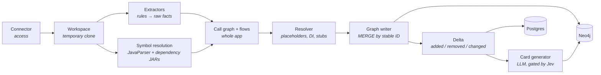
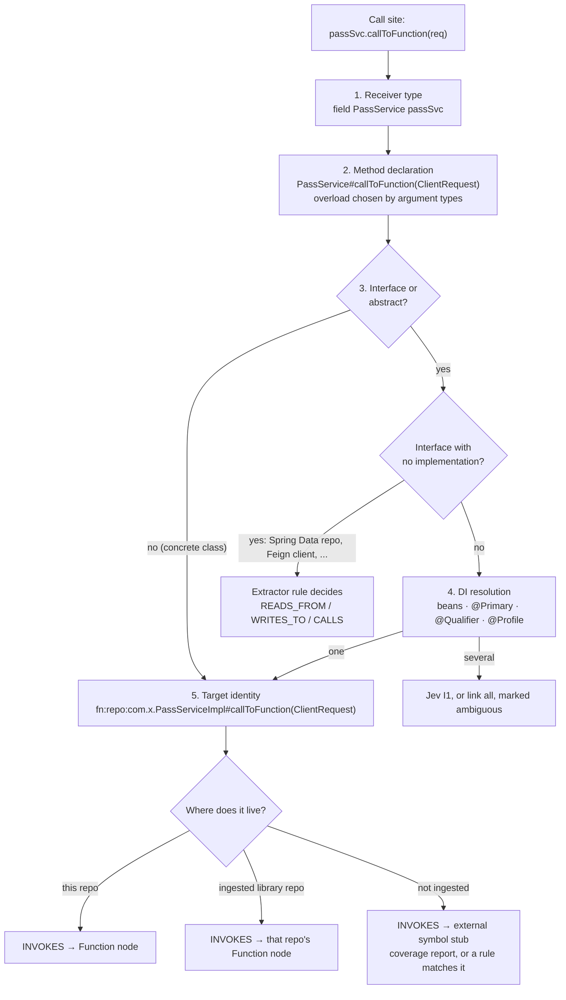
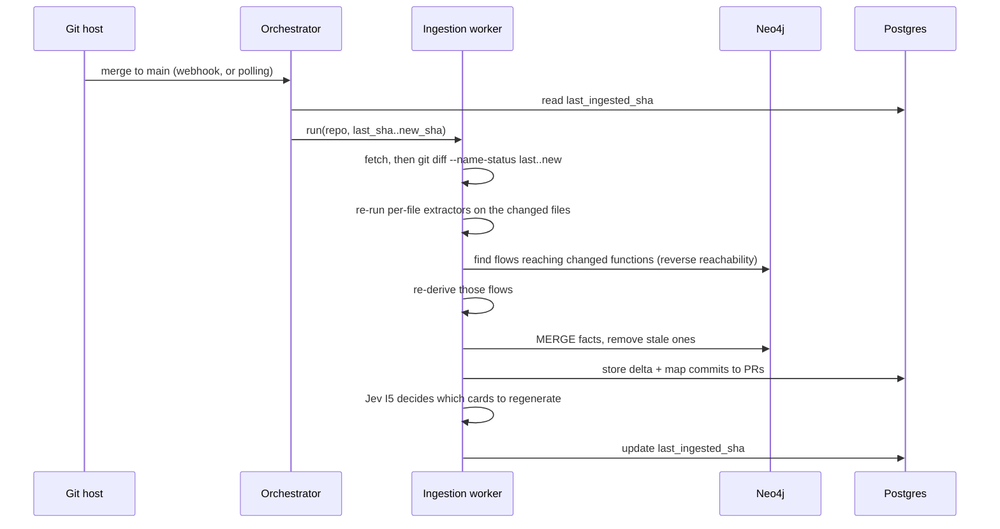
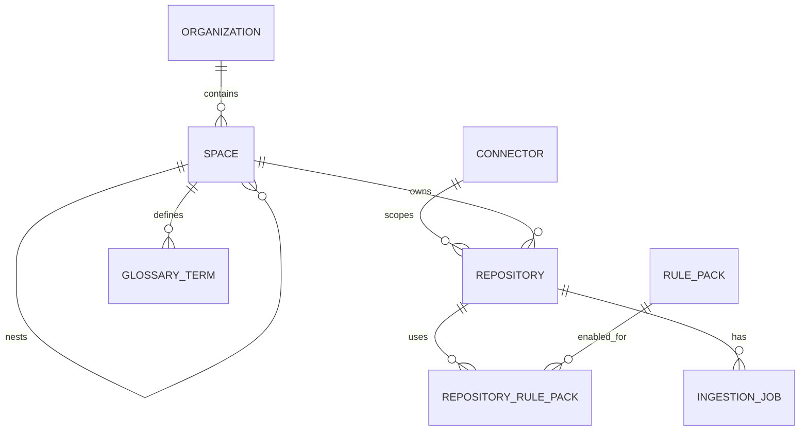
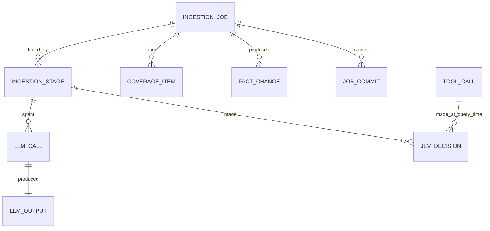

# Ingestion

How Steno turns repositories into graph facts, deterministically and idempotently, in a way any organization can extend. It also covers the relational database that tracks ingestion.

Part of the [Design Doc](./DESIGN_DOC.md). Status markers: **Decided** · **Proposed** · **Open**.

---

## 1. Principles

| Principle | Status |
|---|---|
| **Build bottom-up.** Applications first; space and org views are rollups. | Decided |
| **Deterministic first.** Rules extract facts. Jev decides only what rules can't. The LLM only writes prose. | Decided |
| **Agnostic core, org-specific plugins.** The core defines fact types; extractors are rules and plugins that orgs extend. | Decided |
| **Passive.** Applications don't opt in to anything; Steno reads what already exists. No OpenTelemetry, Terraform, or annotations are required. | Decided |
| **Idempotent.** Re-running any ingestion yields the same graph. | Decided |
| **Static only in Phase 1.** Code and config only. Runtime signals (Splunk, OpenTelemetry) are deferred. | Decided |
| **Secret values are never ingested.** | Proposed |

---

## 2. Pipeline



### Passes per application (Decided)

Flows are **derived**, not extracted one by one:

1. **Per file:** extractors emit structural facts (entry points, interfaces, functions, calls, reads/writes, entities). File order doesn't matter.
2. **Whole application:** build the call graph with symbol resolution, then walk from every entry point to derive all flows at once.
3. **Resolve:** config placeholders, DI candidates, stubs, identities across applications.
4. **Write:** `MERGE` by stable ID, compute the delta, then generate cards for changed nodes only.

---

## 3. Connectors

A connector says **where a source is and how to reach it**. It fetches; it doesn't interpret.

**A connector is a source system plus a scope, not a single repository** (Decided): e.g. a Bitbucket workspace or project, a GitHub organization, or a GitLab group, with its credentials. **Which repositories to ingest is chosen separately:**

| Phase | Repository selection |
|---|---|
| **Phase 1** | An **explicit include list**: one application's repository, or a few |
| **Later** | **Discovery**: Steno lists every repository in the connector's scope through the host's API, filtered by include/exclude patterns, archived status, and recent activity. Placement rules assign the discovered repositories to spaces (below). |

### Access, selection, and placement (Decided)

Three separate questions, kept apart so that one doesn't have to answer the others:

| Concern | Question | Where it lives |
|---|---|---|
| **Access** | What can Steno see on this host? | The connector: base URL, credentials, scope |
| **Selection** | Which repositories get ingested? | The repository list (explicit in Phase 1, discovery later) |
| **Placement** | Which space does a repository belong to? | The repository's space |

A connector's scope never has to be narrowed to one repository: testing on one repository means selecting one repository under a broad connector.

**Placement rules** (Decided; built with discovery) map the host's own structure onto spaces, so an org with thousands of repositories doesn't assign each by hand:

- A rule is a connector, a host grouping (Bitbucket project, GitLab group, GitHub org), and an optional repository-name pattern, pointing at a space: "connector `bitbucket`, project `PAY` → Payroll", "`pay-*` → Payroll". Rules are evaluated in order.
- **An explicit assignment on a repository always wins** over the rules.
- Discovered repositories that no rule matches go to an **unassigned** queue for an admin.
- Phase 1 needs no rules: repositories are selected and placed one at a time.
- Automatic space proposals, if ever added (D27 lists them as not planned), would only suggest rules; an admin approves them.

| Kind | Examples | Phase |
|---|---|---|
| Git host | Bitbucket, GitHub, GitLab | 1 |
| Deployment / infra config | Deployment tooling and infrastructure definitions (Kafka topics, ACLs, deployables), e.g. Terraform, Helm | Later |
| DataStore catalog (read-only) | Postgres, Oracle, Mongo | V2 |
| Logs / traces | Splunk (transaction IDs), OpenTelemetry | Later (runtime) |
| Cloud | AWS, GCP, OpenShift | Later |

Credentials are stored as a **reference to a secret manager**, never in Steno's database.

### Cloning (Decided)

Ingestion workers **clone into a temporary workspace** and delete it after the run. Why clone instead of fetching files through the API:

- Symbol resolution needs the full source tree, plus the dependency JARs (fetched with the build tool, e.g. `mvn dependency:copy-dependencies`, which needs read access to the internal artifact repository).
- Fetching thousands of files hits git host rate limits. A clone is a single request.
- `git diff` between SHAs is local, exact, and detects renames.
- **Optional:** a cache of bare clones turns the next run into a `git fetch`. It's only an optimization; if lost, Steno clones again. Very large repos can use a partial clone (`--filter=blob:none`).

Queries never need a clone. Steno stores **no file contents**: code tools read from the git host API at the ingested commit (see [Retrieval §4](./retrieval-and-mcp.md#4-code-access-decided-no-stored-file-contents)).

### What a config file produces

Config files become **facts** in the graph, plus a raw property map for the resolver.

| Config value | Becomes |
|---|---|
| Kafka topic names, consumer groups | `KafkaTopic` nodes, `CONSUMES` / `PRODUCES` properties |
| Kafka bootstrap servers | `KafkaCluster` node identity (`HOSTED_ON`) |
| Downstream base URLs (`services.billing.url`) | Resolve `CALLS` targets to a host, then an application or `ExternalSystem` |
| Datasource URLs | `DataStore` node identity: host, database, vendor |
| Cron expressions, scheduling config | `Schedule` properties |
| Every property, per profile | Re-read from the clone in every job to resolve placeholders (nothing stored) |
| Secrets | **Never stored.** Recorded as an unresolved reference. |

---

## 4. Extractors: rules for being agnostic

An extractor is a rule: **"when you see X, emit fact Y."** Extractors match **file types and code patterns, not connectors**, so a Spring controller rule works whether the code came from Bitbucket or GitHub.

| Format | Used for | Example |
|---|---|---|
| **[ast-grep](https://ast-grep.github.io/) / [Semgrep](https://semgrep.dev/docs/writing-rules/overview) YAML rules** | Code patterns (tree-sitter based, many languages) | A method annotated `@PostMapping` inside a `@RestController` → `HttpEndpoint` + `EXPOSES` |
| **Config path rules** | YAML / properties / XML | `spring.kafka.consumer.topics` → `KafkaTopic` + `CONSUMES` |
| **Code plugins** | Anything rules can't express | An internal communication framework |

A rule pairs an ast-grep pattern (`match`) with what it means in Steno's vocabulary (`emit`): nodes, edges, **clues** (partial facts a resolver combines across files, such as a router's URL prefix), and **entry points**. Rules never reference each other, and every rule ships with test cases. **The full format: [Extractor Rules](./extractor-rules.md).**

```yaml
id: fastapi-endpoint
match:
  rule:
    kind: decorated_definition
    has: { kind: decorator, has: { pattern: "$ROUTER.$METHOD($PATH $$$)" } }
emit:
  - node: [Interface, HttpEndpoint]
    as: endpoint
    method: $METHOD
    path: $PATH
    prefixed_by: $ROUTER        # a clue resolver adds the router's prefix chain
  - edge: EXPOSES
    from: "@app"
    to: endpoint
  - entry_point: { trigger: endpoint, function: "@function" }
```

- The core ships **common extractors**. Organizations **add plugins** over time without changing the core.
- The first set targets our org's patterns: Kafka configs, controllers, application YAML, service providers, and scheduling (`@Scheduled`, cron).
- **Scheduling differences between orgs** are handled the same way: each mechanism is an extractor that emits a `Schedule` node.
- **Data definitions:** JPA / Spring Data rules produce entities and stub tables. **Org plugins** cover internal mechanisms for defining tables and relationships.

### Rule packs (Decided)

Rules are published as **versioned packs**, like ESLint shareable configs or the Semgrep registry: `steno-pack-spring-web`, `steno-pack-spring-kafka`, `steno-pack-jpa`, plus an org pack such as `yourorg-internal`. Packs are grouped by ecosystem in `rule-packs/` (`java/`, `python/`, `org/`); see [Extractor Rules §6](./extractor-rules.md#6-packs-and-layout-decided).

- **Packs are auto-enabled** from the build file's dependencies (`spring-kafka` present → Kafka pack on).
- Rough size for a Spring/Kafka stack: **~40–60 rules**, written once per framework, not per repository:

| Area | ~Rules |
|---|---|
| Endpoints (mappings, class-level prefixes) | 6 |
| HTTP clients (RestTemplate, WebClient, Feign, generated clients) | 6 |
| Kafka (listeners, `send`, config keys) | 5 |
| gRPC | 3 |
| Scheduling | 3 |
| Data (JPA, `@Document`, repositories, `@Query`, JdbcTemplate, MyBatis) | 8 |
| DI (beans, `@Primary`, `@Qualifier`, `@Profile`) | 6 |
| Build (modules, dependencies, boot plugin) | 4 |
| Config (topics, URLs, datasources, schedules) | 5 |

Org-specific packs are usually a handful of rules for internal frameworks.

### Coverage report (Decided)

After every ingestion, Steno reports **what no rule explained**: call sites that look like I/O and methods that look like entry points (pre-filtered by Jev I8), **ranked by frequency**:

```
UNEXPLAINED (top 3)
  437 call sites → com.yourorg.messaging.Publisher#send(String, Object)
  112 methods    → annotated @PxMessageHandler
   38 call sites → com.yourorg.http.ServiceProvider#invoke(...)
```

The most frequent items are exactly the internal frameworks worth covering. Each can be fixed by:
1. **Ingesting the library's repository**, so calls resolve into its code and its own facts carry through, or
2. **Adding a rule** to the org pack.

Until then, Jev I2/I3 cover them at low confidence.

### Turning a coverage item into a rule (Deferred: future enhancement)

**Phase 1 is fully deterministic.** A person writes each rule, by hand or with the `rule-pack-author` skill as an assistant ([Extractor Rules §8](./extractor-rules.md#8-writing-rules-by-hand-or-with-the-skill-decided)), and the coverage report tells you which rules to write next. Steno itself never generates rules in Phase 1. Everything below is a **future enhancement**, useful once many organizations are writing their own rules.

There's **no LLM scanning the repository.** It works like this:

1. **Deterministic ingestion runs** with the enabled rule packs.
2. **The coverage report is computed deterministically**, then filtered by Jev I8:
   - call sites whose target is an external or unresolved method **and** that look like I/O (the target's package, method names like `send` / `publish` / `invoke` / `execute`, networking or messaging imports)
   - public methods with annotations no rule recognizes

   Items are grouped by target and ranked by how often they occur.
3. **A person reviews the report** and says what an item means, using a form, not a prompt.
4. **Most org rules fit a few templates**, so the rule is generated **without an LLM**:

| Template | The person fills in | Example |
|---|---|---|
| **Call → interaction** | Method, fact type (`PRODUCES` / `CALLS` / `READS_FROM` / `WRITES_TO`), which argument holds the topic, URL, or table | `Publisher#send`, `PRODUCES`, topic = arg 0 |
| **Annotation → entry point** | Annotation, trigger kind, which attribute holds the topic or path | `@PxMessageHandler`, consumes topic, topic = `value` |
| **Annotation → entity / table** | Annotation, which attribute holds the table name | `@PxTable`, table = `name` |
| **Config key → fact** | Key pattern, fact type | `px.messaging.topics.*` → `KafkaTopic` |

5. **Steno validates the rule automatically:** it must match every example from the report, and it shows how many other places it matches, to catch false positives.
6. A person approves it, and it's added to the org pack.

**An LLM is only a fallback** for patterns no template fits. Even then it translates the person's stated intent plus the concrete examples into rule syntax, once per pattern, for a negligible cost. Hand-written rules are always supported.

---

## 5. Symbol and DI resolution

Flows depend on knowing that `passSvc.callToFunction()` refers to a specific method definition. There are two separate problems.

### 5.1 Symbol resolution: what type is `passSvc`, and where is `callToFunction` defined?

**Decided: Steno does its own resolution. SCIP is not planned.**

| Option | How | Tradeoff | Status |
|---|---|---|---|
| **JavaParser + symbol solver + dependency JARs** | Resolves types from source. The dependency JARs (from `mvn dependency:copy-dependencies`, no full build needed) let it resolve types from libraries too. | Resolves most calls, including through library types. Weaker on complex generics, lambdas, and reflection. Runs as a small JVM helper process called from Python. | **Chosen** |
| SCIP (`scip-java`, …) | Runs the real compiler over a full build and outputs every reference | Most accurate, but needs every repo to build in the ingestion environment, which is a large operational effort at org scale | Not planned. Possible future option if measured gaps justify it. |
| Headless language server (jdtls) | Queries an LSP server | Accurate, slow, harder to run | Not planned |

Each additional language needs its own resolver, a cost of skipping SCIP's shared format.

### 5.1a The call resolution plan (Java)

**Goal:** every call site in a flow points to **one exact function** (or an explicitly marked set of candidates), never to "some function called `callToFunction`." Resolving what an interface call actually runs (DI) is one step of the same pipeline, not a separate problem.



1. **Receiver type.** `passSvc` is declared as `private final PassService passSvc;` (or a constructor parameter), so its type is `com.x.PassService`. The JavaParser symbol solver finds this from the repo's source, the **dependency JARs**, and the JDK.
2. **Method declaration.** It finds `PassService#callToFunction(ClientRequest)`, choosing between overloads by argument types, and following inherited methods up the class hierarchy.
3. **Interface or abstract?** If the declared type is a concrete class, go to step 5.
4. **DI resolution:** which implementation does the framework inject?
   1. Candidates: classes implementing the interface, found in the repo and the dependency JARs.
   2. Keep only registered beans: `@Service` / `@Component` / `@Repository`, or `@Bean` methods returning the type.
   3. `@Qualifier` at the injection point matching a bean name, otherwise `@Primary`.
   4. `@Profile` / `@ConditionalOnProperty` evaluated against the app's config.
   5. One left: resolved. Several: Jev I1 chooses; below the threshold, link to all of them, marked `ambiguous`.
   - **Interfaces with no implementation in the code** are generated by the framework at runtime: Spring Data repositories, Feign clients, gRPC stubs. **Extractor rules** handle them: a `JpaRepository<User, …>` method becomes `READS_FROM` / `WRITES_TO` the `users` table; a `@FeignClient` method becomes `CALLS` an endpoint. This is where DI resolution and extractor rules meet.
5. **Target identity.** Every function has a stable ID built from its fully qualified name **and parameter types**: `fn:{repo}:com.x.PassServiceImpl#callToFunction(com.x.ClientRequest)`. So a call always points to **one specific, already-known function**, and two calls to it point to the same node.
6. **Where the target lives:**
   - this repo: `INVOKES` to its `Function` node
   - an ingested library: `INVOKES` to that repo's node, matched by the same identity
   - not ingested: `INVOKES` to an **external symbol stub**, unless a rule recognizes it (e.g. `KafkaTemplate#send` → `PRODUCES`); frequent stubs show up in the coverage report

**Known gaps**, marked instead of guessed:
- reflection
- dynamic proxies beyond the ones rules cover
- event dispatch (`ApplicationEventPublisher` → `@EventListener`), which needs a rule to link publisher and listener
- lambdas passed through generic code, when their target can't be determined


**Internal libraries:**
- **Library repository ingested:** calls resolve into its functions, keyed by fully qualified name, and its facts (e.g. publishing to Kafka) carry through into the flows that call it.
- **Not ingested:** the call ends at a stub for the external symbol, which shows up in the coverage report.

### 5.1b The call resolution plan (Python) (Decided)

Steno's own small resolver, built on tree-sitter (D51). It answers the same questions as the Java plan with Python's rules:

1. **Names:** follow `import` / `from … import … as …` and module-level assignments, so `job_router` in `__init__.py` and `router` in `job.py` are the same symbol.
2. **Types:** from annotations (`client: httpx.AsyncClient`, `-> Ollama`), constructor assignments (`x = Job()`), `with … as x`, and `self.x` attributes set in `__init__`.
3. **Methods:** find the method on the resolved type, walking base classes in the repository and, by name, in libraries.
4. **DI:** FastAPI's `Depends(provider)` uses the parameter's annotation when it's concrete; otherwise the provider's return type.

What it can't follow (dynamic attribute access, values built at runtime, untyped parameters) is marked unresolved and shows up in the coverage report. Pyright or Jedi are options only if those gaps turn out to matter.

### 5.2 DI rules are per-framework plugins

Step 4 above is Spring's set of rules. Other frameworks (Guice, Dagger, .NET DI) are separate plugins with their own rules for registration and selection, so the pipeline stays agnostic.

---

## 6. Resolver

- **Config placeholders:** `${kafka.topics.orders}` is resolved by walking `application.yml` → `application-{env}.yml` → `${X:default}` defaults.
- **Secret values are never ingested.** A value that comes from a vault is recorded as an **unresolved reference** with low confidence. Topic names and URLs are rarely secrets.
- **Identity:** outbound calls and topics resolve to stable IDs, and stubs are created for targets not yet ingested.
- **Internal vs. vendor hosts:** a list of known org domains, with Jev I4 for anything not on it.

### Glossary (Decided: human-declared in V1)

Org vocabulary often appears nowhere in the code ("Swing" is a nickname for a specific application), so in V1 **people declare it**:

```yaml
# glossary.yaml, one per space (or entered in the UI later)
Swing: app/pay-adjustment-svc
PEO: "Professional Employer Organization"; entity/PeoClient
```

- A declared term that points at a node is used by search to **expand questions** into graph nodes.
- Code-derived **suggestions** (repo, module, and package names without a declared term) can be shown to admins as prompts, but they're never added automatically.
- **Later:** deriving terms from documentation and the product side comes with the **Contextualized integration**, which already has access to docs and the why behind changes.

---

## 7. Idempotency and updates

### Stable IDs and replacement by scope (Decided)

- Every node and edge has a **stable ID derived from natural keys**, so re-ingesting finds the same nodes.
- Every fact records the `ingestion_job` that wrote it. Re-ingesting a scope (a repo, or a set of files):
  1. `MERGE` all current facts.
  2. Delete that scope's facts from older runs.
  3. Remove shared nodes (topics, tables) only when nothing references them anymore.
- **The delta** comes from comparing fact sets by stable ID: added, removed, or changed.

### Incremental updates on merge to main (Decided)



- **Diff by commit range, not by PR.** Steno stores **one** `last_ingested_sha` per repository. The range covers every change since then:
  - a missed webhook heals itself on the next run
  - direct pushes and reverts are caught
  - squashes and rebases don't matter
- **PRs are used for attribution.** Commits in the range are mapped to their PRs. The range says *what* changed; the PR says *who and why*. That's the link to Projects later.

### Steno owns re-ingestion (Decided)

Only Steno's extractors can produce facts in Steno's model. Contextualized later adds the **attribution** (which Project) and the **why**. It never supplies the structural facts.

---

## 8. Relational database (Postgres)

**Principle: Postgres holds what Steno is *told* and what Steno *did*. Neo4j holds what Steno *knows*.**

- **Declared structure** (the organization, spaces, glossary) has its **source of truth in Postgres** and is **projected into Neo4j** as nodes and edges. (Decided)
- **Neo4j can be rebuilt** from Postgres plus the repositories, **without re-spending on the LLM**, because every generated text is cached in `llm_output`. Nothing is stored only in Neo4j. (Decided)
- **One Steno deployment per organization**, so no tables carry an `organization_id`. The organization itself is the single row in `organization`. (Decided)
- **The work queue lives in Postgres:** workers claim `queued` jobs with `SELECT … FOR UPDATE SKIP LOCKED`, so no separate broker is needed. (Decided)

**Configuration and jobs:**



**What each job records:**



### Columns

| Table | Columns |
|---|---|
| `organization` | `id` (always 1), `name`, `description`, `onboarded_at` |
| `connector` | `id`, `name`, `kind` (bitbucket / github / gitlab), `base_url`, `scope` (json: workspace, project, org), `credentials_ref` |
| `repository` | `id`, `connector_id`, `space_id`, `name`, `clone_url`, `default_branch`, `selection` (included / discovered / excluded), `last_ingested_sha`, `status` |
| `space` | `id`, `parent_id`, `name`, `description` |
| `glossary_term` | `id`, `space_id`, `term`, `target_node_id`, `definition` |
| `rule_pack` | `id`, `name`, `version`, `source` (core / org) |
| `repository_rule_pack` | `repository_id`, `rule_pack_id`, `enabled`, `reason` (auto / manual) |
| `ingestion_job` | `id`, `repository_id`, `trigger` (initial / merge / manual), `mode` (full / incremental / dry_run), `from_sha`, `to_sha`, `status` (queued / running / succeeded / failed), `queued_at`, `started_at`, `finished_at`, `error`, `stats` (json) |
| `ingestion_stage` | `id`, `job_id`, `stage` (clone / deps / parse / resolve / flows / write / cards), `started_at`, `finished_at`, `status`, `metrics` (json), `llm_cost`, `jev_cost` |
| `coverage_item` | `id`, `job_id`, `repository_id`, `kind` (call site / annotation), `target_symbol`, `occurrences`, `samples` (json), `status` (open / ignored / covered) |
| `fact_change` | `id`, `job_id`, `fact_id`, `fact_type`, `change` (added / removed / modified), `before` (json), `after` (json), `commit_sha` |
| `job_commit` | `job_id`, `commit_sha`, `pr_number`, `pr_url`, `merged_at` |
| `llm_call` | `id`, `job_id`, `stage_id`, `node_id`, `purpose`, `model`, `input_tokens`, `output_tokens`, `cached_tokens`, `cost`, `latency_ms` |
| `llm_output` | `id`, `llm_call_id`, `node_id`, `kind`, `input_hash`, `text`, `is_current` |
| `jev_decision` | `id`, `stage_id` (ingestion) or `request_id` (query), `decision`, `input` (json), `output` (json), `confidence`, `latency_ms` |
| `tool_call` | `id`, `session_id`, `request_id`, `tool`, `params` (json), `latency_ms`, `result_count`, `at` |

### Configuration: what Steno is told

| Table | Why |
|---|---|
| `organization` | The organization this deployment serves: one row, entered in onboarding. The root of the space tree. Projected into Neo4j. |
| `connector` | A source system plus a scope (a Bitbucket workspace or project, a GitHub org). `credentials_ref` points into a secret manager; secrets are never stored. |
| `repository` | The include list now, discovery later (`selection`: included / discovered / excluded). `space_id` places it in the org. `last_ingested_sha` drives incremental updates. |
| `space` | Admin-declared spaces, which can nest. Projected into Neo4j. |
| `glossary_term` | Human-declared vocabulary: a term, its definition, and the node it refers to. Projected into Neo4j. |
| `rule_pack`, `repository_rule_pack` | Which rule packs (and versions) apply to which repository, and whether each was auto-enabled from dependencies or added manually. |

### Operations: what Steno did

| Table | Why |
|---|---|
| `ingestion_job` | Every job (`trigger`: initial / merge / manual; `mode`: full / incremental / **dry_run**) and its status (**queued** / running / succeeded / failed). **It's also the work queue.** |
| `ingestion_stage` | Per stage (clone, deps, parse, resolve, flows, write, cards): timings, metrics (files, functions, flows), and **cost** (`llm_cost`, `jev_cost`, summed from the calls made in that stage). This is the dry-run report. |
| `coverage_item` | What **no rule explained** but looks like it matters: unexplained call sites and unrecognized annotations, with occurrence counts and sample locations. `status` is open / ignored / covered, so it's tracked across jobs, noise stays hidden once ignored, and open items measure how complete an app's graph is. |

### Change history

| Table | Why |
|---|---|
| `fact_change` | One row per fact a job **added, removed, or modified**, with `before` and `after`. It backs "what changed in this merge?" (`get_changes`), delta-driven testing, and debugging. Re-ingesting the same commit must produce **zero rows**, which makes it an automated idempotency test. `commit_sha` is set when exactly one commit in the range touched the change's file, which attributes it to one PR. |
| `job_commit` | Every commit (and its PR) that a job covered. It enables "introduced in PR #123" in citations, and it's the bridge Contextualized will use for PR → Project. |

**What `fact_change` records.** The graph itself always reflects **every** change in full; this table is only the **history log**:
- **Architecture nodes:** every change to flows, steps, interfaces, effects, entities, and tables, including LLM text that was regenerated.
- **Code nodes:** one row per function **added, removed, or modified** (signature or body, detected by a body hash). Individual `INVOKES` edges aren't logged one by one; a function whose calls changed shows up as "modified," and any effect of that change on flows and steps is logged in full on the architecture side.

### Audit, cost, and caching

| Table | Why |
|---|---|
| `llm_call` | Every LLM call: purpose (flow purpose, flow narrative, app card, …), model, tokens (including cached), cost, latency, and the stage it ran in |
| `llm_output` | The text each call produced, tied to its `llm_call` and its node. Looked up by `(node_id, kind, input_hash)` before calling the LLM, so unchanged inputs are never paid for twice. `is_current` keeps earlier versions. |
| `jev_decision` | Every Jev input, output, confidence, and latency. From ingestion, it's linked to the stage; at query time, to the request. |
| `tool_call` | Every MCP tool call from agents: tool, parameters, latency, result count, grouped by `session_id`. It measures round trips per question and the latency targets, shows chatty patterns worth a batch tool, and joins with `jev_decision` to debug a bad answer. |

Admins declare the organization, spaces, connectors, and repositories in the UI, starting with the onboarding flow (DESIGN_DOC §13).
