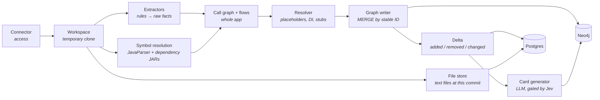
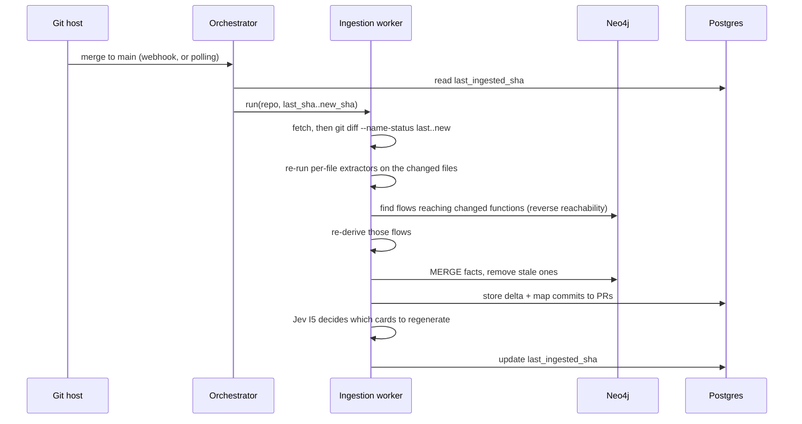
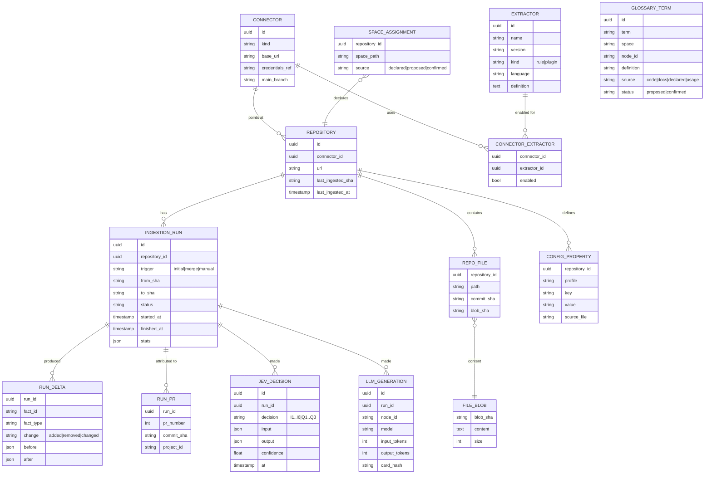

# Ingestion

How Steno turns repositories into graph facts, deterministically and idempotently, in a way any organization can extend. It also covers the relational database that tracks ingestion.

Part of the [Design Doc](./DESIGN_DOC.md). Status markers: **Decided** · **Proposed** · **Open**.

---

## 1. Principles

| Principle | Status |
|---|---|
| **Build bottom-up.** Applications first; space and org views are rollups. | Decided |
| **Deterministic first.** Rules extract facts. Jev decides only what rules can't. The LLM only writes prose. | Decided |
| **Agnostic core, org-specific plugins.** The core defines fact types; extractors are rules and plugins that orgs extend. | Decided |
| **Passive.** Applications don't opt in to anything; Steno reads what already exists. No OpenTelemetry, Terraform, or annotations are required. | Decided |
| **Idempotent.** Re-running any ingestion yields the same graph. | Decided |
| **Static only in Phase 1.** Code and config only. Runtime signals (Splunk, OpenTelemetry) are deferred. | Decided |
| **Secret values are never ingested.** | Proposed |

---

## 2. Pipeline



### Passes per application (Proposed)

Flows are **derived**, not extracted one by one:

1. **Per file:** extractors emit structural facts (entry points, interfaces, functions, calls, reads/writes, entities). File order doesn't matter.
2. **Whole application:** build the call graph with symbol resolution, then walk from every entry point to derive all flows at once.
3. **Resolve:** config placeholders, DI candidates, stubs, identities across applications.
4. **Write:** `MERGE` by stable ID, compute the delta, then generate cards for changed nodes only.

---

## 3. Connectors

A connector says **where a source is and how to reach it**. It fetches; it doesn't interpret.

| Kind | Examples | Phase |
|---|---|---|
| Git host | Bitbucket, GitHub, GitLab | 1 |
| Deployment / infra config | XLDeploy (Kafka topics, ACLs, deployables), Terraform / Helm | Later |
| DataStore catalog (read-only) | Postgres, Oracle, Mongo | V2 |
| Logs / traces | Splunk (transaction IDs), OpenTelemetry | Later (runtime) |
| Cloud | AWS, GCP, OpenShift | Later |

Credentials are stored as a **reference to a secret manager**, never in Steno's database.

### Cloning (Proposed)

Ingestion workers **clone into a temporary workspace** and delete it after the run. Why clone instead of fetching files through the API:

- Symbol resolution needs the full source tree, plus the dependency JARs (fetched with the build tool, e.g. `mvn dependency:copy-dependencies`, which needs read access to the internal artifact repository).
- Fetching thousands of files hits git host rate limits. A clone is a single request.
- `git diff` between SHAs is local, exact, and detects renames.
- **Optional:** a cache of bare clones turns the next run into a `git fetch`. It's only an optimization; if lost, Steno clones again. Very large repos can use a partial clone (`--filter=blob:none`).

Queries never need a clone. Ingestion saves the repo's text files to Steno's **file store** (Proposed, option A in [Retrieval §4](./retrieval-and-mcp.md#4-code-access)), and MCP tools read from there.

### What a config file produces

Config files become **facts** in the graph, plus a raw property map for the resolver. The file itself also goes into the file store.

| Config value | Becomes |
|---|---|
| Kafka topic names, consumer groups | `KafkaTopic` nodes, `CONSUMES` / `PRODUCES` properties |
| Kafka bootstrap servers | `KafkaCluster` node identity (`HOSTED_ON`) |
| Downstream base URLs (`services.billing.url`) | Resolve `CALLS` targets to a host, then an application or `ExternalSystem` |
| Datasource URLs | `DataStore` node identity: host, database, vendor |
| Cron expressions, scheduling config | `Schedule` properties |
| Every property, per profile | A `config_property` table in Postgres, used to resolve placeholders during incremental updates |
| Secrets | **Never stored.** Recorded as an unresolved reference. |

---

## 4. Extractors: rules for being agnostic

An extractor is a rule: **"when you see X, emit fact Y."** Extractors match **file types and code patterns, not connectors**, so a Spring controller rule works whether the code came from Bitbucket or GitHub.

| Format | Used for | Example |
|---|---|---|
| **[ast-grep](https://ast-grep.github.io/) / [Semgrep](https://semgrep.dev/docs/writing-rules/overview) YAML rules** | Code patterns (tree-sitter based, many languages) | A method annotated `@PostMapping` inside a `@RestController` → `HttpEndpoint` + `EXPOSES` |
| **Config path rules** | YAML / properties / XML | `spring.kafka.consumer.topics` → `KafkaTopic` + `CONSUMES` |
| **Code plugins** | Anything rules can't express | An internal communication framework |

Sketch of a rule:

```yaml
id: spring-get-endpoint
language: java
rule:
  pattern: |
    @GetMapping($PATH)
    $RET $METHOD($$$ARGS) { $$$ }
  inside:
    kind: class_declaration
    has: { pattern: "@RestController" }
emit:
  node: { labels: [Interface, HttpEndpoint], method: GET, path: $PATH }
  edge: { type: EXPOSES, from: application }
  anchor: $METHOD
```

- The core ships **common extractors**. Organizations **add plugins** over time without changing the core.
- The first set targets our org's patterns: Kafka configs, controllers, application YAML, service providers, and scheduling (`@Scheduled`, cron).
- **Scheduling differences between orgs** are handled the same way: each mechanism is an extractor that emits a `Schedule` node.
- **Data definitions:** JPA / Spring Data rules produce entities and stub tables. **Org plugins** cover internal mechanisms for defining tables and relationships.

### Rule packs (Proposed)

Rules are published as **versioned packs**, like ESLint shareable configs or the Semgrep registry: `steno-pack-spring-web`, `steno-pack-spring-kafka`, `steno-pack-jpa`, plus an org pack such as `yourorg-internal`.

- **Packs are auto-enabled** from the build file's dependencies (`spring-kafka` present → Kafka pack on).
- Rough size for a Spring/Kafka stack: **~40–60 rules**, written once per framework, not per repository:

| Area | ~Rules |
|---|---|
| Endpoints (mappings, class-level prefixes) | 6 |
| HTTP clients (RestTemplate, WebClient, Feign, generated clients) | 6 |
| Kafka (listeners, `send`, config keys) | 5 |
| gRPC | 3 |
| Scheduling | 3 |
| Data (JPA, `@Document`, repositories, `@Query`, JdbcTemplate, MyBatis) | 8 |
| DI (beans, `@Primary`, `@Qualifier`, `@Profile`) | 6 |
| Build (modules, dependencies, boot plugin) | 4 |
| Config (topics, URLs, datasources, schedules) | 5 |

Org-specific packs are usually a handful of rules for internal frameworks.

### Coverage report (Proposed)

After every ingestion, Steno reports **what no rule explained**: call sites that look like I/O and methods that look like entry points (pre-filtered by Jev I8), **ranked by frequency**:

```
UNEXPLAINED (top 3)
  437 call sites → com.yourorg.messaging.Publisher#send(String, Object)
  112 methods    → annotated @PxMessageHandler
   38 call sites → com.yourorg.http.ServiceProvider#invoke(...)
```

The most frequent items are exactly the internal frameworks worth covering. Each can be fixed by:
1. **Ingesting the library's repository**, so calls resolve into its code and its own facts carry through, or
2. **Adding a rule** to the org pack.

Until then, Jev I2/I3 cover them at low confidence.

### LLM-drafted rules (Optional)

Instead of writing a rule by hand, a person picks an item from the coverage report and says what it means, e.g. "this is `PRODUCES`; the topic is argument 0." Then:
1. An LLM drafts the rule from that intent plus the concrete examples in the report.
2. Steno **validates it automatically**: it must match every example, and the number of other matches in the repo is shown, to catch false positives.
3. A human approves it, and it joins the org pack.

The LLM knows what's wanted because the person states the intent and the examples come from the report. Cost is negligible: it runs once per new pattern (tens per org, ever), a few thousand tokens each, never during ingestion. Writing rules by hand remains fully supported.

---

## 5. Symbol and DI resolution

Flows depend on knowing that `passSvc.callToFunction()` refers to a specific method definition. There are two separate problems.

### 5.1 Symbol resolution: what type is `passSvc`, and where is `callToFunction` defined?

**Decided: Steno does its own resolution. SCIP is not planned.**

| Option | How | Tradeoff | Status |
|---|---|---|---|
| **JavaParser + symbol solver + dependency JARs** | Resolves types from source. The dependency JARs (from `mvn dependency:copy-dependencies`, no full build needed) let it resolve types from libraries too. | Resolves most calls, including through library types. Weaker on complex generics, lambdas, and reflection. Runs as a small JVM helper process called from Python. | **Chosen** |
| SCIP (`scip-java`, …) | Runs the real compiler over a full build and outputs every reference | Most accurate, but needs every repo to build in the ingestion environment, which is a large operational effort at org scale | Not planned. Possible future option if measured gaps justify it. |
| Headless language server (jdtls) | Queries an LSP server | Accurate, slow, harder to run | Not planned |

Each additional language needs its own resolver, a cost of skipping SCIP's shared format.

**Internal libraries:**
- **Library repository ingested:** calls resolve into its functions, keyed by fully qualified name, and its facts (e.g. publishing to Kafka) carry through into the flows that call it.
- **Not ingested:** the call ends at a stub for the external symbol, which shows up in the coverage report.

### 5.2 DI resolution: `PassService` is an interface, so which implementation runs?

The compiler can't answer this, because the framework decides at runtime. Rules are applied in order:

1. Exactly one implementing bean (`@Service` / `@Component` / `@Bean`): resolved.
2. `@Primary`, or a `@Qualifier` matching a bean name: resolved.
3. `@Profile` / `@ConditionalOnProperty` evaluated against config: resolved.
4. Still ambiguous: **Jev I1** chooses (see [Jev](./jev.md)). Below the threshold, the call links to **all** candidates, marked `ambiguous`.

These DI rules are **per-framework plugins** (Spring, Guice, Dagger, .NET DI).

---

## 6. Resolver

- **Config placeholders:** `${kafka.topics.orders}` is resolved by walking `application.yml` → `application-{env}.yml` → `${X:default}` defaults.
- **Secret values are never ingested.** A value that comes from a vault is recorded as an **unresolved reference** with low confidence. Topic names and URLs are rarely secrets.
- **Identity:** outbound calls and topics resolve to stable IDs, and stubs are created for targets not yet ingested.
- **Internal vs. vendor hosts:** a list of known org domains, with Jev I4 for anything not on it.

### Glossary (Open: how it's populated)

Mapping org vocabulary to graph nodes ("Swing" → a specific application) is hard, because a nickname may appear nowhere in the code. Candidate sources, from most to least automatic:

1. **Code and structure:** repo names, module and package names (`com.yourorg.swing.*`), application names. Jev I7 maps a term to its node when the evidence exists.
2. **Docs:** READMEs and ADRs in the repos (Confluence through a later connector). Acronyms and capitalized terms become candidates, which Jev I7 maps.
3. **Declared:** a `glossary.yaml` per space, seeded by the team, e.g. `Swing: app/pay-adjustment-svc`.
4. **Learned from usage:** unknown terms in agents' questions are logged to a review queue.
5. **Confirmation:** a human confirms every proposed mapping (in the UI, later).

The LLM writes each term's definition. The `glossary` tool and the search pipeline use the mappings to expand questions into graph nodes.

---

## 7. Idempotency and updates

### Stable IDs and replacement by scope (Proposed)

- Every node and edge has a **stable ID derived from natural keys**, so re-ingesting finds the same nodes.
- Every fact records the `ingestion_run` that wrote it. Re-ingesting a scope (a repo, or a set of files):
  1. `MERGE` all current facts.
  2. Delete that scope's facts from older runs.
  3. Remove shared nodes (topics, tables) only when nothing references them anymore.
- **The delta** comes from comparing fact sets by stable ID: added, removed, or changed.

### Incremental updates on merge to main (Decided)



- **Diff by commit range, not by PR.** Steno stores **one** `last_ingested_sha` per repository. The range covers every change since then:
  - a missed webhook heals itself on the next run
  - direct pushes and reverts are caught
  - squashes and rebases don't matter
- **PRs are used for attribution.** Commits in the range are mapped to their PRs. The range says *what* changed; the PR says *who and why*. That's the link to Projects later.
- Update the file store for the changed files.

### Steno owns re-ingestion (Decided)

Only Steno's extractors can produce facts in Steno's model. Contextualized later adds the **attribution** (which Project) and the **why**. It never supplies the structural facts.

---

## 8. Relational database (Postgres)

Holds **application state**. The knowledge itself lives in Neo4j.



| Table | Why |
|---|---|
| `connector`, `repository` | What to ingest and how to reach it. `last_ingested_sha` drives incremental updates. |
| `extractor`, `connector_extractor` | The registry of rules and plugins, and which ones run where |
| `space_assignment` | The declared or confirmed space structure, the source of truth for onboarding (proposals come from Jev I6) |
| `ingestion_run` | What's running, what has run, status, and stats |
| `run_delta` | What each run changed. **`before` / `after` hold the previous and new state of changed facts** (Proposed; this is what makes delta-driven testing possible without full version history). |
| `run_pr` | Commit → PR → (later) Project attribution |
| `jev_decision` | Every Jev input and output, for checking calibration and auditing |
| `llm_generation` | Cost tracking for card generation |
| `repo_file`, `file_blob` | **The file store** (Proposed, option A): every text file at the ingested commit. Contents keyed by git blob SHA, so unchanged files are stored once. |
| `config_property` | Every config property, per profile, for resolving placeholders |
| `glossary_term` | Term → node mappings, with their source and confirmation status |

In the POC, the connector and space configuration can start as config files and move into these tables later.
