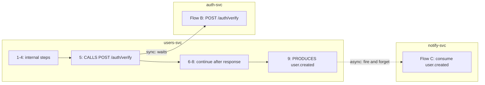

# Knowledge Graph Model

How Steno represents an organization's architecture in Neo4j: labels, properties, relationships, ownership, flows, and data stores.

Part of the [Design Doc](./DESIGN_DOC.md). Status markers: **Decided** · **Proposed** · **Open**.

---

## 1. Modeling principles

| Principle | Status |
|---|---|
| **Facts are stored at the lowest level, and higher layers are rollups.** Communication within and between spaces is derived from application-level facts, never stored separately. | Decided |
| **Interfaces are nodes.** Endpoints, topics, and data stores are nodes of their own. Apps connect to them, and edges between apps appear automatically when two apps reference the same interface node. | Decided |
| **Every node has exactly one owner in the tree.** A node's layer is where it sits, not a property of its type. | Decided |
| **Abstraction uses labels, not `IS_A` edges.** Neo4j is a property graph: a node can have several labels. | Decided |
| **Every fact records where it came from** (repo, symbol, ingested commit), what produced it (rule, Jev decision), and its **confidence**. | Decided |
| **Every fact can be traced to its origin Project** through `Project -CHANGED-> element` edges, added once Contextualized supplies project deltas. | Decided |

### Three independent aspects of every node

| Aspect | Question | Stored as |
|---|---|---|
| **What it is** | Kind / abstraction | **Labels**, e.g. `(:Interface:KafkaTopic)` |
| **Where it lives** | Owner in the tree | **Exactly one** `BELONGS_TO` edge |
| **What it interacts with** | Behavior | Interaction edges: `CALLS`, `PRODUCES`, `CONSUMES`, `READS_FROM`, `WRITES_TO`, `STARTS` |

- `MATCH (i:Interface)` returns every interface. `MATCH (t:KafkaTopic)` returns only topics. No type nodes are needed.
- **Properties** hold attributes: vendor, HTTP method, cron expression.
- Something gets **its own node** only if it really exists and has relationships of its own (a Kafka cluster, a database server).
- The graph's schema (the list of allowed node and edge types) is documentation and code. It isn't data in the graph.

---

## 2. One graph: layers, architecture nodes, and code nodes

Steno uses **one graph in one Neo4j database**. Two ideas describe its shape, and they're different things:

- **The three layers** (Organization → Space → Application) are the **levels of zoom**. They're the backbone of the containment tree.
- **Architecture nodes vs. code nodes** is a split by **kind of node**: what the software *does* vs. how its code is *built*. Both hang off the same tree.

```
Organization                              ← layer 1
 └ Space  (can nest)                      ← layer 2
    ├ DataStore → Schema → Table, KafkaTopic / Queue
    ├ Application                         ← layer 3
    │   ├ Interface, Entity, Schedule
    │   └ Flow  {trace: every function, in order}      architecture nodes: what it DOES
    │      └ Step  {symbol, file, lines}
    └ Repository ─────── Module (:Service ◀──BUILT_FROM── Application)
                          └ File                               code nodes: how it's BUILT
```

**Functions are not nodes (D60).** The call graph is built in memory during each run, used to derive flows, and discarded. What survives is each flow's **trace** (L3, [below](#trace-entries)): the ordered list of functions the flow runs, with file and lines at the ingested commit. Steps and trace entries point into the code by symbol and lines, and the code itself is read from the git host.

**What decides which side a node is on.** Every node is extracted from code, so the split isn't about where a node came from. It's about **what the node describes**. The test:

> **If you refactored the code without changing its behavior (split a class, moved a file, renamed a method), would this node change?**
> **Yes → code node.** It exists because of how the code is *organized*.
> **No → architecture node.** It exists because of what the software *does*, or what others can see and depend on.

| Node | Changes on a refactor? | Side | Why |
|---|---|---|---|
| Repository, Module, File | Yes | **Code** | Pure code organization |
| Organization, Space | No | Architecture | How the org is divided |
| Application | No | Architecture | The deployable unit; other teams depend on it |
| Interface (endpoint, topic, gRPC method) | No | Architecture | A contract other apps call |
| DataStore, Table | No | Architecture | Shared state other apps touch |
| ExternalSystem | No | Architecture | Something outside the org that's depended on |
| Flow | No | Architecture | Behavior: what happens when a trigger fires |
| Step | No (only its `symbol` and lines may change) | Architecture | Behavior: "write the audit record" is still a step even if the code doing it moves |
| Entity | Borderline (renaming the class renames it) | Architecture | Describes a data contract (payloads, tables) that others see |

After a refactor, only the code pointers (a step's `symbol` and lines, the flow's trace, `BUILT_FROM`) change. Flows and steps stay the same.

**What the split controls**, and nothing more: (1) search, cards, and routing only cover architecture nodes; (2) change history logs architecture nodes in full and trace changes per flow.

| | Architecture nodes | Code nodes |
|---|---|---|
| **Kinds** | Organization, Space, Application, Interface, Flow, Step, Entity, DataStore, Table, ExternalSystem, … | Repository, Module, File (functions live in flow traces) |
| **Answers** | What exists, what it does, what it touches, flows step by step | Exactly what code runs at each step |
| **Queried** | Always: routing, cards, and search run **only** on these | Only after narrowing to one app or flow, through its steps and trace |
| **Effects** | On the Step that performs them (`Step -WRITES_TO-> Table`), rolled up onto Flows | Listed on the trace entry of the function that performs them |
| **Change history** | Every change logged | Trace changes logged per flow (functions added, removed, moved) |

**Bridges** between the two kinds: `Application -BUILT_FROM-> Module`, plus the symbol and file pointers on steps and trace entries.

**Why make the distinction at all?**
- **Speed.** Search never wanders into code; it's enforced with labels and edge types.
- **Meaningful change tracking.** Architecture nodes change rarely and meaningfully; code changes on every edit. Keeping functions out of the graph means a refactor that changes no behavior writes no graph nodes (see [Depth and storage](#depth-and-storage-decided-traces-not-function-nodes)).

Other points:
- **An Application is not a Module.** An Application is the deployable unit (architecture); a Module is the build unit (code). A `:Service` module builds an Application. Packages aren't nodes.
- **Architecture nodes describe behavior down to each step without touching code.** Agents drop into a flow's trace, and from there into the source, only for fine detail.
- Every node has exactly one `BELONGS_TO` owner. A Repository belongs to a Space, so code nodes are anchored in the same tree.

## 3. Node types

| Node (labels) | Owner (`BELONGS_TO`) | Key properties | Notes |
|---|---|---|---|
| `Organization` | none (root) | `name`, `purpose` | |
| `Space` | Organization or parent Space | `name`, `purpose` | Any way an org divides itself. Can nest to any depth. |
| `Repository` | Space | `url`, `default_branch`, `last_ingested_sha` | What a connector points at. Can contain many applications. |
| `Application` | Space | `name`, `purpose` | An **independently deployable unit**. `(:Application)-[:BUILT_FROM]->(:Module)` |
| `Module` (+ role label) | Repository | `path`, `build_tool` | The ecosystem's build unit: a Maven/Gradle module, a Python package with its own `pyproject.toml`, an npm workspace, a Go module. **Not a namespace package**: packages are paths. See [Module roles](#module-roles). |
| `File` | Module | `path`, `language`, `content_hash` | |
| `Interface` + `HttpEndpoint` | exposing Application | `method`, `path` | |
| `Interface` + `GrpcMethod` | exposing Application | `service`, `method` | |
| `Interface` + `KafkaTopic` / `Queue` | **a Space**, never an Application | `name` | See [Topic ownership](#topic-ownership) |
| `Interface` + org-defined label | a Space, like topics | `name` (the shared key) | An org's own communication channel, e.g. `:PxChannel`. See [Communication of any kind](#communication-of-any-kind-decided). |
| `Schedule` | Application | `kind` (cron / fixed-rate / fixed-delay), `expression` | A trigger that isn't an interface |
| `Flow` | Application | `name`, `entry_symbol`, `entry_file`, `entry_lines`, `trace`, `trace_files`, `trace_symbols` (see [Trace entries](#trace-entries)), `primary_entity`, `operation`, `technical` (from Jev I9 / I10) | See [Flows](#6-flows) |
| `Step` | Flow | `path` (e.g. `1.1.3`), `label` (LLM phrasing), `branch_raw`, `branch` (LLM phrasing), `effects` | One significant step of a flow (L2). Also carries its function's `symbol`, `file`, and `lines` at the ingested commit; its effects are edges from the Step. |
| `DataStore` + `Relational` / `Document` / `KeyValue` / `Search` / `Graph` / `Vector` | Space | `vendor` (Postgres, Oracle, Mongo, Redis, …), `version`, `host`, `database` | The **category is a label**, because it changes the model (relational stores have schemas and tables; document and vector stores have collections). The **vendor is a property**, because it's an open-ended list that doesn't change the model. |
| `Schema` | DataStore | `name` | V1: only when the code names one |
| `Table` | Schema, or DataStore when there's no schema | `name`, `kind` (table / collection / index), `stub` | V1: stubs. V2: filled in. See [Data stores](#7-data-stores). |
| `Column` | Table | `name`, `type`, `nullable`, `purpose` | V2 |
| `Entity` | Application | `name`, `symbol`, `fields` [{name, type}] | Domain models and payloads in any language: JPA classes, SQLAlchemy / Pydantic models, protobuf / Avro messages, DTOs |
| `ExternalSystem` | Organization | `host`, `name` | Vendor and third-party APIs |
| `KafkaCluster` (and other brokers) | Organization | `name` | Infrastructure, attached with `HOSTED_ON` |

Candidates for later: `Team`/owner, deployment `Environment`.

### Trace entries

A flow's **trace** (L3) is the ordered list of every first-party function it runs: a depth-first walk of the call graph from the entry function, ordered by call site. It's stored **on the `Flow` node**, not as nodes of its own (D60, D63): `trace` holds the ordered entries as a JSON string (Neo4j properties can't nest), and `trace_files` and `trace_symbols` are string lists for lookups such as "which flows touch this file?". It's rebuilt on every run and replaced as a whole.

**What's in it (D63):** every first-party function the flow calls, helpers included, once per call site. A function tagged `utility` (high fan-in, no interaction below it) appears at its call site, but its own callees aren't expanded: nothing architectural is below it, and this is what keeps traces bounded. The UI shows significant steps by default and expands to the full trace.

**One schema for every language.** A Java method, a Python function, and a Go method are all trace entries with the same fields. Language differences live in the **rule packs and symbol resolvers**. Fields a language doesn't have are left empty, and anything truly language-specific goes in the `lang` bag.

**How much to store:** only what's needed to (1) **identify** a function, (2) **show the flow in order**, and (3) **point into the code**. Resolving and traversing calls happens in memory during the run, so parameter types, annotations, and visibility aren't kept.

| Field | Meaning | Java example | Python example | Why |
|---|---|---|---|---|
| `path` | Position in the walk (`1.2.1`) | `1.2` | `1.3.1` | Order and nesting |
| `symbol` | Qualified name, plus `({param types})` where the language has overloading | `com.x.PassServiceImpl#callToFunction(com.x.ClientRequest)` | `app.services.job.JobService.run_data_source_job` | Identity, keyword lookup |
| `bound_to` | The subclass an inherited method runs as (below) | `com.x.DiffTask` | `app.tasks.diff.DiffTaskRunner` | Flows follow the real implementation |
| `name`, `container` | Short name, and the class or module it's defined in | `callToFunction`, `com.x.PassServiceImpl` | `run_data_source_job`, `app.services.job.JobService` | Display |
| `file`, `start_line`, `end_line` | Where it is, at the ingested commit | `services/users/src/.../PassServiceImpl.java`, `42`, `87` | `apps/backend/app/services/job.py`, `111`, `146` | `view_flow_code`, citations, "which flows touch this file?" |
| `call_line` | The line of the call site in the caller | `61` | `128` | Citations |
| `conditional`, `in_loop`, `async`, `ambiguous`, `candidate` | How it's called (from the call site) | | | Branches, async steps, DI uncertainty |
| `effects` | What this function does directly: `[{edge: WRITES_TO, target: table:…}]` | | | The step it belongs to, rollups |
| `significant`, `utility` | Derived tags (see [Significance](#significance-is-a-derived-tag-decided)) | | | Presentation |
| `step` | On a significant entry: which occurrence of that function's Step this is (its Step node is `step:{flow}:{symbol}[@bound_to][#n]`, keyed by function, not position, so inserting a step doesn't renumber the others) | `1` | `1` | Links L3 to L2 |
| `repeat`, `recursive` | Called again after it was already expanded in this flow (listed, not expanded again); or called while already on the current path | | | Keeps traces bounded |
| `body_hash` | A hash of the function's syntax tree (ignores moves and formatting) | | | Change history: which functions changed |
| `doc` | First sentence of its doc comment | | "Creates Job, builds the applicable Tasks, and runs them." | Cards |
| `lang` | Language-specific extras, only when needed | `{throws: ["IOException"]}` | `{is_generator: false}` | Kept out of the shared schema |

**Not stored:** function bodies (the source is fetched from the git host at the ingested commit), local variables, statements, and functions no entry point reaches. A function with effects that no flow reaches becomes a [coverage item](./ingestion.md#coverage-report-decided) instead.

**A function shared by several flows** appears in each of their traces. "Which flows run `AuthService#identifyClient`?" or "which flows touch `ClientValidator.java`?" is a lookup across traces by `symbol` or `file`.

**Inherited methods that call subclass code: bound entries (Decided, D58, D60).** A base class often runs shared steps and calls a method each subclass provides (`Task.run` calls `self.execute()`). Reached through `DiffTaskRunner(...).run()`, that code runs `DiffTaskRunner.execute`; reached through `EmbedTaskRunner(...).run()`, it runs Embed's. So the trace entry for the inherited method carries `bound_to` naming the subclass, and the entries beneath it are that subclass's methods, so a flow lists Diff's work, then Embed's, in order. When the code doesn't say which subclass it is (a factory returning the base type), every implementation is listed beneath the call, marked `candidate`.

**The same rule (one schema for every language) applies to every node type.** `Module` is whatever the ecosystem's build unit is (a Maven/Gradle module, a Python package with its own `pyproject.toml`, an npm workspace, a Go module), and `Entity` covers JPA classes, SQLAlchemy models, Pydantic models, protobuf messages, and so on.

### Properties every fact carries

| Property | Purpose |
|---|---|
| `id` | **Stable ID derived from natural keys**, e.g. `endpoint:{app}:{METHOD}:{path}`, `topic:{cluster}:{name}`, `flow:{app}:{trigger}`, `table:{datastore}:{schema}:{name}` |
| `source` | `{repo, symbol, commit}`: where the fact came from |
| `extracted_by` | Rule ID and version, or Jev decision ID |
| `confidence` | 0–1. Deterministic rules produce 1.0. Jev-produced facts carry Jev's confidence. |
| `ingestion_job` | ID of the job that last wrote the fact (used for idempotent replacement) |
| `first_seen`, `last_seen`, `ingested_commit` | Cheap insurance toward version history later |

Which Project introduced or changed a fact isn't a property. It's recorded later as `Project -CHANGED-> element` edges from Contextualized (see [Business context](#business-context-from-contextualized-later)).

### Card properties (searchable nodes only)

Cards exist **only** on node types that search covers: **Flow, Application, Space, Organization, Interface, Entity, Table**. Steps, traces, modules, files, and edges have no card. These nodes also carry the `:Searchable` label, so one vector index and one full-text index cover them all.

| Property | Purpose |
|---|---|
| `card` | The summary text: deterministic facts plus, for flows, apps, spaces, and the org, LLM-written purpose and narrative (see [Retrieval](./retrieval-and-mcp.md#summary-cards-decided)) |
| `card_embedding` | The card's vector, which the vector index searches to find candidates for a question |
| `card_embedding_model` | Which model produced the vector. The question must be embedded with the same model; changing models means re-embedding. |
| `card_hash` | A fingerprint of the inputs the card was built from. On re-ingestion, an unchanged fingerprint means the card and its embedding are still valid, so nothing is re-embedded or re-checked. |

### Module roles

A role is an **optional label**. A module with no role is still an ordinary `Module`.

| Role | Detected by (deterministic) | Treatment |
|---|---|---|
| `:Service` | Produces a deployable: Spring Boot main class / boot packaging plugin, its own Dockerfile, its own deployment descriptor | Gets an `Application` |
| `:Library` | Other modules depend on it; produces no deployable | Stored once, shared by the services that depend on it |
| `:Contract` | Holds `.proto`, OpenAPI, or Avro definitions | Rules read it for `Interface` definitions |
| `:Migrations` | Flyway / Liquibase scripts | Recognized in V1, parsed in V2 |
| `:Test` | Test sources, integration-test modules | Excluded from flows |
| `:Build` | Parent POM, BOM, aggregator, code generators, Helm / Terraform | Structure only |

Example, our microservices repository:

```
(:Repository microservices)
 ├─ (:Module:Service services/users)  ◀─BUILT_FROM─ (:Application users-svc)
 ├─ (:Module:Service services/auth)   ◀─BUILT_FROM─ (:Application auth-svc)
 └─ (:Module:Library plugins/logging) ◀─DEPENDS_ON─ users-svc, auth-svc
```

- Library code in the same repository is analyzed with the services. Flows in `users-svc` run into `plugins/*` functions, which appear in their traces, so "which services use plugin X?" is answered by `DEPENDS_ON` (built in) or a trace lookup (actually run). How traces continue into a library in **another** repository is Open.
- If a library brings in an endpoint that's auto-configured into every service (e.g. a shared health check), each Application that includes it `EXPOSES` it.
- A single-service repo is the simplest case of the same model.

### Topic ownership

A topic is shared infrastructure, so no Application owns it. It `BELONGS_TO` exactly one of these, whichever is found first:

1. The **Space that declares it**, e.g. in deployment or infrastructure definitions of topics and ACLs.
2. The **producer's Space**, by convention.
3. The **Organization**, if neither is known.

`(:KafkaTopic)-[:HOSTED_ON]->(:KafkaCluster)` is **not** an ownership edge.

### Communication of any kind (Decided)

Kafka, HTTP, and gRPC are special cases of one pattern (D61). Any communication between applications has three parts:

| Part | What it is | In the graph |
|---|---|---|
| **Sender** | A call that puts something somewhere: `kafkaTemplate.send(topic, …)`, `messenger.post(channel, …)`, an HTTP client call | `Step -PRODUCES-> Interface` (or `CALLS` when the sender waits for a reply) |
| **Receiver** | Code the framework runs when something arrives: `@KafkaListener`, `@OnMessage("x")`, a handler registered in config | An entry point: `Interface -STARTS-> Flow` |
| **Shared key** | What joins the two: a topic, channel, queue, subject, URL, or table | The `Interface` node's stable ID |

An organization's own messaging framework, whether or not it wraps Kafka, gets an **org-defined `Interface` label** (`:PxChannel`) and **two rules** in the org pack, one for the sender and one for the receiver. Applications connect automatically when their keys match, exactly as with Kafka topics. Communication through shared state (one app writes a table, another polls it) needs nothing extra: both point at the same `Table` node.

---

## 4. Relationship types

Every relationship is either **extracted** (read directly from code or config by a rule) or **derived** (computed by Steno from other relationships, and stored only so traversals are faster). Derived relationships are recomputed whenever their inputs change.

| Relationship | From → To | Properties | Meaning | Source |
|---|---|---|---|---|
| `BELONGS_TO` | child → owner | | The containment tree. Exactly one per node (except the root). | Extracted |
| `BUILT_FROM` | Application → Module | | Which module builds the deployable | Extracted (build files) |
| `DEPENDS_ON` | Module → Module | `scope` | A **build dependency**, from `pom.xml` / `build.gradle`: `services/users` depends on `plugins/logging` | Extracted (build files) |
| `EXPOSES` | Application → Interface | | The app serves this endpoint or method | Extracted |
| `CALLS` | Step → Interface / ExternalSystem | `transport`, `confidence` | **A network call** to an endpoint or gRPC method | Extracted |
| `PRODUCES` / `CONSUMES` | Step → KafkaTopic / Queue / org-defined Interface | `consumer_group` | Async messaging. A consumer that's a flow's trigger is `STARTS`; `CONSUMES` is for a step that reads messages itself (polling). | Extracted |
| `READS_FROM` / `WRITES_TO` | Step → Table / DataStore | `operation` | Data access. Table-level when known. | Extracted |
| `STARTS` | Interface / Schedule → Flow | | **What starts a flow**: this endpoint, topic, or schedule kicks it off | Extracted |
| `FIRST_STEP` | Flow → Step | | **L2**: the flow's first step | Derived |
| `NEXT` | Step → Step | | **L2**: the step that follows, at the same nesting level | Derived |
| `SUBSTEP` | Step → Step | | **L2**: the first step nested inside this one (step 1 → step 1.1) | Derived |
| `WRITES_TO` / `READS_FROM` / `CALLS` / `PRODUCES` (on a Flow) | Flow → Table / ExternalSystem / Interface / Topic | `conditional` | **L1 rollups**: everything the flow's steps touch, lifted onto the flow | Derived |
| `LEADS_TO` | Flow → Flow | `mode: sync\|async`, `via` | **This flow leads to that one.** Exists exactly when a step in Flow A `CALLS` or `PRODUCES` to an interface that `STARTS` Flow B. | **Derived** |
| `USES_ENTITY` | Interface / Flow → Entity | `role: request\|response\|message` | Payload contracts | Extracted |
| `MAPS_TO` | Entity → Table | | **ORM mapping**: the `User` class maps to the `users` table (`@Table(name="users")`) | Extracted |
| `HOSTED_ON` | KafkaTopic → KafkaCluster | | Infrastructure placement | Extracted (config) |

Extracted effects are found on a function during the run and attached to the **Step** for that function (every function with an effect is a significant step, so every effect has one). They're also listed on its trace entry.

**How the verbs differ:** `CALLS` is code calling over the network. `STARTS` is what kicks off a flow. `LEADS_TO` is one flow causing another. Code calling code (`INVOKES`) exists only in the run's in-memory call graph, where rules can still add to it (an async background task, D45); it reaches the graph as the order of a flow's steps and trace.

```
Flow A ──FIRST_STEP──▶ Step 1 ──NEXT──▶ Step 2 ──CALLS──▶ POST /verify ──STARTS──▶ Flow B
  │                                                                                  ▲
  └──────────────────────────────── LEADS_TO (derived) ──────────────────────────────┘
```

**App-level and space-level edges are rollups.** For example, `(:Application)-[:CALLS]->(:Application)` is computed from `Flow-CALLS->Interface<-EXPOSES-Application` (the flow belongs to the calling app), and can be materialized for speed.

### Internal vs. external is derived

Walk both ends of a call up the tree to their lowest common ancestor:

| Lowest common ancestor | Meaning |
|---|---|
| Same Application | A call to itself |
| Same Space | Communication within the space |
| Different Spaces | Communication across spaces |
| Target is `ExternalSystem` | Outside the org |

### Stubs

When a call's target isn't ingested yet, it points at a **stub** node keyed by its natural key (URL + method, topic name, table name), with `stub: true`. When the owning application is ingested, the real node **merges** into the stub by stable ID. The same pattern is used for `Table` nodes in V1.

---

## 5. Example queries

```cypher
// Who consumes this topic? (1 hop)
MATCH (t:KafkaTopic {name: 'user.created'})-[:STARTS]->(:Flow)-[:BELONGS_TO]->(a:Application)
RETURN DISTINCT a.name

// Blast radius: every flow downstream of an endpoint (variable-length path)
MATCH (e:HttpEndpoint {id: $id})-[:STARTS]->(f:Flow)-[:LEADS_TO*0..10]->(down:Flow)
RETURN down

// Communication across spaces (rollup)
MATCH (s1:Space)<-[:BELONGS_TO*]-(:Flow)-[:CALLS]->(:Interface)<-[:EXPOSES]-(:Application)-[:BELONGS_TO*]->(s2:Space)
WHERE s1 <> s2
RETURN s1.name, s2.name, count(*) AS calls
```

---

## 6. Flows

### Definitions (Decided)

- **Function**: a unit of code. It exists in the run's call graph and in flow traces, not as a node.
- **Flow**: a **unit of work**. The execution that starts at an **entry function** invoked by a **trigger**, plus everything that function reaches.
- **There is no `Job` type.** Flows differ only by what triggers them:
  - `(:Interface)-[:STARTS]->(:Flow)`: HTTP, gRPC, a consumed topic
  - `(:Schedule)-[:STARTS]->(:Flow)`: cron, Spring `@Scheduled`, Quartz, a Kubernetes CronJob

  Sync vs. async isn't the dividing line (a Kafka consumer is async). Each org's scheduling mechanism is a rule (or plugin) that emits the same `Schedule` node.
- **There is no `Subflow` type.** Shared logic ("identify client") is a function that appears in several flows' traces.

### Flow levels and the flow card (Decided)

A flow is described at four levels, from a one-line headline down to every function it touches. Each level lives in a specific place in the graph:

| Level | What it answers | Where it lives | Produced by |
|---|---|---|---|
| **L0 Headline** | "What is this, in one line?" | `Flow` properties: `trigger`, `purpose` | Trigger: deterministic. Purpose: **LLM** (declared docs are an input, not a substitute) |
| **L1 Signature** | "What goes in, what comes out, what does it touch?" | `Flow` properties **and rollup edges** (`Flow -WRITES_TO-> Table`, `Flow -CALLS-> ExternalSystem`, …) | **Deterministic** (facts) |
| **L1 Narrative** | "What does it do, step by step, in plain words, and when does it branch?" | `Flow.narrative` | **LLM** |
| **L2 Steps** | "What happens, in what order, and where exactly?" | `Step` nodes: `Flow -FIRST_STEP-> Step -NEXT-> Step`, nested with `SUBSTEP`; each carries its function's symbol and lines, and its effects | **Deterministic** structure (the significance rule); step labels phrased by the LLM |
| **L3 Trace** | "Every function it touches" | The flow's **trace**: every function in order, with file and lines ([Trace entries](#trace-entries)) | **Deterministic** |

**L1 has two halves.** The *signature* is facts: the trigger, inputs, outputs, effects, external calls. The *narrative* (purpose, steps in plain words, branch conditions in plain words) needs an LLM. A branch's raw condition, e.g. `ds.type == DataSourceType.REPOSITORY and ds.scope_by_issues`, is extracted deterministically; "if the repository is issue-scoped" is the LLM's phrasing of it.

**Inputs and outputs depend on the trigger:**

| Trigger | IN | OUT |
|---|---|---|
| HTTP / gRPC | Request entity, path/query params | Response entity, status codes |
| Kafka / queue consumer | Topic, **message entity**, consumer group | None. Results are its effects (produces, writes); may produce to a retry or dead-letter topic. |
| Schedule | Schedule expression, config it reads | None. Results are its effects. |

**Branch** = a point where the flow takes different paths that lead to **different effects**: an `if` / `switch`, or runtime dispatch to one of several implementations. Branches that don't change effects aren't listed.

#### Worked example: Contextualized's "run a Job for one source"

`POST /jobs/projects/{project_id}/data-sources/{data_source_id}` in [Contextualized](https://github.com/KBavis/contextualized) (commit `ac93a3b`, illustrative):

The Flow node holds L0 and L1 as properties. Its `Step` nodes (L2) chain in order, and its trace (L3) lists every function underneath them:

```
(HttpEndpoint) ──STARTS──▶ (Flow)                     L0 + L1 as properties; rollups: WRITES_TO jobs, CALLS Jira, …
                              │
                          FIRST_STEP
                              ▼
                   (Step 1: create job) ──NEXT──▶ (Step 2: sync linked PRs) ──NEXT──▶ (Step 3: re-embed files) ──NEXT──▶ …
                   symbol: JobService.create_job          │
                                                       SUBSTEP
                                                          ▼
                                    (Step 2.1: fetch Jira issues) ──NEXT──▶ (Step 2.2: resolve PRs) ──▶ …
                                    symbol: JiraDataProvider.get_issues

   trace (L3):  1 run_data_source_job  job.py:43-61
                1.1 JobService.create_job  services/job.py:88-109        WRITES_TO jobs
                1.2 JobService.run_data_source_job  services/job.py:111-146
                1.2.1 [conditional] JiraDataProvider.get_issues  …       CALLS Jira
                …
```

What's stored **on the `Flow` node**:

```yaml
(:Flow:Searchable)
  id:           flow:contextualized-backend:POST /jobs/projects/{project_id}/data-sources/{data_source_id}
  # L0
  trigger:      "POST /jobs/projects/{project_id}/data-sources/{data_source_id} (HTTP; 202, then background task)"
  purpose:      "Syncs one data source for a project: pulls the Jira-linked PRs and their file diffs for
                 issue-scoped repos, then downloads, chunks, and re-embeds the source's files."   # LLM
  purpose_source: llm            # llm | declared | contextualized
  # L1 signature (deterministic)
  in:           {path: [project_id, data_source_id]}
  out:          {status: 202, body: [message, project_id, data_source_id]}
  mode:         sync-response, async-work
  branches_raw: ["ds.type == REPOSITORY and ds.scope_by_issues", "from_provider(data_source) → Bitbucket|GitHub|Confluence"]
  # L1 narrative (LLM)
  narrative:    "1. Create a Job. 2. If the repository is issue-scoped: find the project's Jira issues, resolve
                 their merged PRs in Bitbucket, and store each new PR and its file diffs. 3. Download the
                 source's files, chunk docs and code, embed them into Chroma and the docstore.
                 4. Roll up the task statuses into the Job's status."
  # card (rendered from the above) + retrieval
  card:         <text below>
  card_hash:    sha256(inputs)
  card_embedding: [ … ]
```

Its **rollup edges** (L1): `WRITES_TO` jobs, diff_tasks, embed_tasks, record_locks, pull_requests, project_file_diffs, docstore_chunks, and the Chroma collection. `READS_FROM` data_sources, projects. `CALLS` Jira, Bitbucket, the embedding model, and ⟨GitHub | Confluence⟩ (conditional).

Its **`Step` nodes** (L2) chain with `NEXT` and nest with `SUBSTEP`. Each has its path (`1.1.3`), a label, its branch, its effects, and a citation: its function's symbol, file, and lines at the commit.

**The rendered flow card** (one text, used for embeddings, for Jev digests, and for agents):

```
POST /jobs/projects/{project_id}/data-sources/{data_source_id}   · contextualized-backend · HTTP 202 + background
PURPOSE  Syncs one data source for a project: pulls Jira-linked PRs and their file diffs (issue-scoped
         repos), then downloads, chunks, and re-embeds the source's files.
STEPS    create job → [issue-scoped] Jira issues → linked PRs → store PRs + diffs → download files
         → chunk docs/code → embed to Chroma + docstore → roll up status
TOUCHES  writes jobs, pull_requests, project_file_diffs, docstore_chunks, Chroma · calls Jira, Bitbucket, embedding model
LEADS TO —
CONTEXT  (from Contextualized, later) Created by: … · Modified by: …
SOURCE   run_data_source_job  apps/backend/app/api/routers/job.py:43 @ ac93a3b
```

- **Calls to another app** show the endpoint plus the **downstream flow's L0 purpose**, e.g. `auth-svc POST /verify → "verify caller token"`, and nothing more. Deeper detail comes from following `LEADS_TO`.
- The card is **bounded by construction**, however large the flow is. Detail lives in L2 and L3, one call away.
- **Cards are written during the run, from the in-memory analysis.** The worker still has the clone, the full call graph, and every function's source when the cards stage runs, so nothing about cards depends on storing functions.

#### How the purpose and narrative are generated

- **At initial ingestion, every flow gets an LLM purpose and narrative** (Decided). Without them, semantic search has nothing meaningful to match, and declared summaries are often missing or vague.
- **LLM input:** the L1 signature, the L2 skeleton with raw branch conditions, declared docs (route summaries, docstrings, Javadoc, OpenAPI), the code of the significant steps (bounded), and the downstream flows' L0 purposes.
- **Keeping cost down at scale:** a small model by default, the Batch API, and **prompt caching**: flows in the same application share a cached prefix (the app's card, its entities, its conventions), so each flow pays only for its own facts. The dry run measures the real cost before any spend.
- **On re-ingestion:** when a change touches functions in a flow's trace, the deterministic parts are rebuilt for free. A trace that changed only by renames or moved lines, with the same effects and calls, keeps its card. **Jev I5** is given the old purpose and narrative plus the fact diff and the changed step names, and decides whether they're still accurate. The LLM regenerates them only if not.

#### Business context from Contextualized (later)

**Contextualized is where business purpose comes from.** Projects are attached **at the granularity of what they changed**, never assumed to explain a whole flow:

```
(:Project {id, name, summary})-[:CHANGED {kind: added|modified|removed, pr, commit}]->(element)
```

`element` is whatever the Project's delta touched: a `Flow` (when it created the whole flow, or changed only its internals: functions in its trace), a `Step`, a rollup edge's target (a new `WRITES_TO audit_log`), an `Interface`, or a `Table`.

- **A new flow created by a Project:** that Project's context explains the whole flow.
- **An existing flow changed by a Project:** the context is scoped to the change, e.g. "Project B added the audit write at step 1.2." The card's CONTEXT line says exactly that. A PR that only refactored internals is found by matching its changed files and lines against flow traces: "PR #812 changed the internals of *Create Client*."
- **Flows no Project has touched** keep their code-derived purpose (`purpose_source: llm`).

### Depth and storage (Decided: traces, not Function nodes)

The graph stores **architecture nodes plus a trace per flow**. Functions are not nodes (D60):

| Layer | Contains | Queried when |
|---|---|---|
| **Architecture nodes** | Orgs, spaces, apps, interfaces, flows (L0, L1), **steps (L2)**, entities, tables, external systems | Always: routing and search run **only** here |
| **Code nodes** | Repository, Module, File | Orientation: what a repository contains and which modules build which applications |
| **Traces (L3)** | Every first-party function each flow runs, in order, with file and lines | Only after narrowing to one flow: full detail, code navigation, "which flows touch this file?" |

- **Why not persist Function nodes:** they'd be most of the graph, they change on nearly every merge even when behavior doesn't, and agents get code detail from the trace plus the source read from the git host. With traces, a refactor that changes no architecture writes no graph nodes.
- **What it costs:** every run rebuilds the repository's call graph in memory. Runs are nightly and only for repositories that changed (D59), so this is compute, not a design constraint.
- **Size:** a trace is tens to a few hundred entries. A shared function appears once per flow that runs it, which is accepted for simpler, per-flow replacement.
- **Excluded:** third-party library code, generated code, tests, and functions no entry point reaches.
- **Nothing is dropped for being "insignificant."** Pure business logic (a tax calculation) does no I/O, and an I/O-based filter would lose it. It's in the trace, tagged.

### Significance is a derived tag (Decided)

| Tag | Rule (computed from facts, deterministic) | Display |
|---|---|---|
| `significant` | An entry point, **or** it performs an interaction directly (`CALLS`, `PRODUCES`, `READS_FROM`, `WRITES_TO`), **or** an interaction happens somewhere below it | Shown first |
| `utility` | High fan-in **and** no interaction below it (string/date helpers) | Collapsed, still viewable |

### Order (Decided)

Calls in the run's call graph carry `seq`, the position of the call site in the caller. A flow's trace, and its steps, are a **depth-first walk ordered by `seq`**, which makes them an ordered tree:

```
1      UserController#getUser                      ← entry (INITIATED by GET /users)
1.1    AuthService#identifyClient                  (utility, collapsed)
1.2    UserService#load
1.2.1    UserRepository#findById                   READS_FROM users.users
1.3    [conditional] AuditPublisher#publish        PRODUCES user.viewed
```

**Known limit:** this is the order of call sites *in the source*. Branches, loops, and async calls are marked, but which branch runs isn't known without runtime signals, which are deferred.

### Flows across services (Decided)

A flow **points to** another flow across an interface. It **never contains** it.



- **Sync:** A's step 5 waits for Flow B. The **stitched view** nests B's steps under step 5, then continues with 6–8. The stitching happens during traversal; nothing is copied.
- **Async:** A continues immediately. B runs later, and the stitched view marks it `async` without claiming an order.
- A topic `STARTS` **every** consumer's flow, so one produce can fan out to many flows.
- A path across 10 microservices is a chain of per-application flows.

### Anchors (Decided)

Steps and trace entries point to **symbols** (`com.x.RefundService#process`) at an ingested commit, plus that commit's file and lines. Code tools read at the ingested commit, so the lines are exact; symbols are what stay stable across runs.

---

## 7. Data stores

**Deferring schema introspection doesn't mean ignoring data.** V1 creates the nodes V2 fills in.

| | V1 (from application code) | V2 (schema itself) |
|---|---|---|
| **Entity → table** | JPA `@Entity`/`@Table`, Mongo `@Document` → `MAPS_TO`. **Plus org plugins** for internal mechanisms that define tables and relationships. | |
| **Reads/writes** | Table-level where stated statically: Spring Data repos, `@Query`, MyBatis SQL | |
| **`Table` nodes** | Stubs: name + stable ID | Columns, constraints, relationships, purpose (LLM) |
| **Migrations** | Modules recognized (`:Migrations`) | Parsed |
| **Sources** | Code | 1. Live catalog (read-only DataStore connector), 2. **Migrations replayed into a temporary database** (e.g. Testcontainers), then reading its catalog, 3. ORM entities |

V1 already answers "which applications touch the `users` table?" and "which entities map to it?". The names stay agnostic: a Mongo collection is a `Table` with `kind: collection`.

**The `DataStore → Schema → Table → Column` arrows are the ownership chain (`BELONGS_TO`).** What exists in each version:

| Node | V1 | V2 |
|---|---|---|
| `DataStore` | Yes, identified from datasource config (host, database, vendor) | Yes |
| `Schema` | Only when the code names one (e.g. `@Table(schema="payroll")`) | Yes |
| `Table` | Stubs from entities, repositories, SQL, and org plugins | Filled in |
| `Column` | No | Yes |
