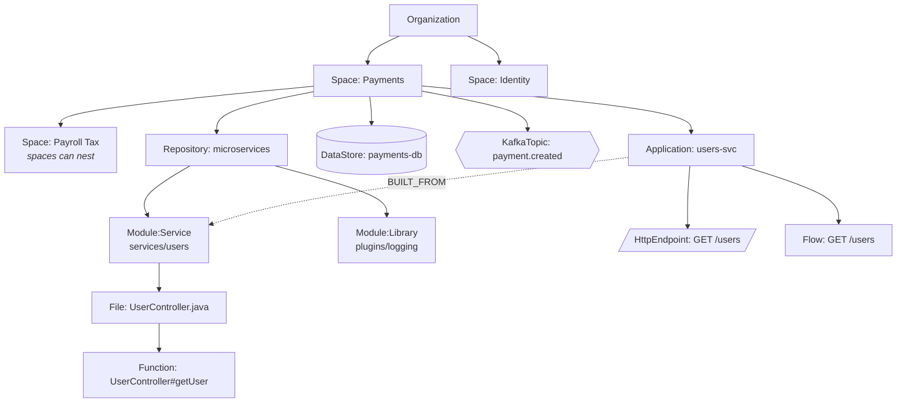
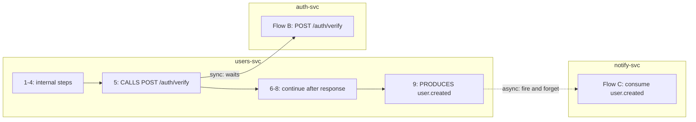

# Knowledge Graph Model

How Steno represents an organization's architecture in Neo4j: labels, properties, relationships, ownership, flows, and data stores.

Part of the [Design Doc](./DESIGN_DOC.md). Status markers: **Decided** · **Proposed** · **Open**.

---

## 1. Modeling principles

| Principle | Status |
|---|---|
| **Facts are stored at the lowest level, and higher layers are rollups.** Communication within and between spaces is derived from application-level facts, never stored separately. | Decided |
| **Interfaces are nodes.** Endpoints, topics, and data stores are nodes of their own. Apps connect to them, and edges between apps appear automatically when two apps reference the same interface node. | Decided |
| **Every node has exactly one owner in the tree.** A node's layer is where it sits, not a property of its type. | Decided |
| **Abstraction uses labels, not `IS_A` edges.** Neo4j is a property graph: a node can have several labels. | Proposed |
| **Every fact records where it came from** (repo, symbol, ingested commit), what produced it (extractor, Jev decision), and its **confidence**. | Decided |
| **Every fact has room for its origin Project** (`introduced_by`, `modified_by`), filled in once Contextualized supplies project deltas. | Decided |

### Three independent aspects of every node

| Aspect | Question | Stored as |
|---|---|---|
| **What it is** | Kind / abstraction | **Labels**, e.g. `(:Interface:KafkaTopic)` |
| **Where it lives** | Owner in the tree | **Exactly one** `BELONGS_TO` edge |
| **What it interacts with** | Behavior | Interaction edges: `CALLS`, `PRODUCES`, `CONSUMES`, `READS_FROM`, `WRITES_TO`, `STARTS`, `INVOKES` |

- `MATCH (i:Interface)` returns every interface. `MATCH (t:KafkaTopic)` returns only topics. No type nodes are needed.
- **Properties** hold attributes: vendor, HTTP method, cron expression.
- Something gets **its own node** only if it really exists and has relationships of its own (a Kafka cluster, a database server).
- The graph's schema (the list of allowed node and edge types) is documentation and code. It isn't data in the graph.

---

## 2. Layers and ownership



Solid arrows are `BELONGS_TO`, drawn from parent to child for readability. Steno uses three layers: **Organization → Space → Application**. Repositories, modules, files, and functions sit under them as the code structure.

---

## 3. Node types

| Node (labels) | Owner (`BELONGS_TO`) | Key properties | Notes |
|---|---|---|---|
| `Organization` | none (root) | `name`, `purpose` | |
| `Space` | Organization or parent Space | `name`, `purpose` | Any way an org divides itself. Can nest to any depth. |
| `Repository` | Space | `url`, `default_branch`, `last_ingested_sha` | What a connector points at. Can contain many applications. |
| `Application` | Space | `name`, `purpose` | An **independently deployable unit**. `(:Application)-[:BUILT_FROM]->(:Module)` |
| `Module` (+ role label) | Repository | `path`, `build_tool` | A build unit (Maven/Gradle module). **Not a package**: packages are paths. See [Module roles](#module-roles). |
| `File` | Module | `path`, `language`, `content_hash` | |
| `Function` | File | `symbol`, `signature`, tags `significant`, `utility` | Every first-party function reachable from an entry point. See [Flows](#6-flows). |
| `Interface` + `HttpEndpoint` | exposing Application | `method`, `path` | |
| `Interface` + `GrpcMethod` | exposing Application | `service`, `method` | |
| `Interface` + `KafkaTopic` / `Queue` | **a Space**, never an Application | `name` | See [Topic ownership](#topic-ownership) |
| `Interface` + plugin-defined label | depends on the plugin | | e.g. the named messages of an internal communication framework |
| `Schedule` | Application | `kind` (cron / fixed-rate / fixed-delay), `expression` | A trigger that isn't an interface |
| `Flow` | Application | `name`, `entry_symbol`, `steps` | See [Flows](#6-flows) |
| `DataStore` | Space | `type` (SQL, NoSQL, …), `vendor` | |
| `Schema` → `Table` → `Column` | DataStore → Schema → Table | `name`, `kind` | V1 creates `Table` stubs. V2 fills them in. See [Data stores](#7-data-stores). |
| `Entity` | Application | `name`, `fields` | Domain models, request/response payloads |
| `ExternalSystem` | Organization | `host`, `name` | Vendor and third-party APIs |
| `KafkaCluster` (and other brokers) | Organization | `name` | Infrastructure, attached with `HOSTED_ON` |

Candidates for later: `Team`/owner, deployment `Environment`.

### Properties every fact carries

| Property | Purpose |
|---|---|
| `id` | **Stable ID derived from natural keys**, e.g. `endpoint:{app}:{METHOD}:{path}`, `topic:{cluster}:{name}`, `fn:{repo}:{symbol}`, `table:{datastore}:{schema}:{name}` |
| `source` | `{repo, symbol, commit}`: where the fact came from |
| `extracted_by` | Extractor ID and version, or Jev decision ID |
| `confidence` | 0–1. Deterministic rules produce 1.0. Jev-produced facts carry Jev's confidence. |
| `ingestion_run` | ID of the run that last wrote the fact (used for idempotent replacement) |
| `first_seen`, `last_seen`, `ingested_commit` | Cheap insurance toward version history later |
| `introduced_by`, `modified_by` | Project IDs from Contextualized. Empty until that integration exists. |
| `card`, `card_hash`, `card_embedding` | LLM summary card, the hash of the facts it was written from, and its vector (see [Retrieval](./retrieval-and-mcp.md#summary-cards)). Only some node types get cards. |

### Module roles

A role is an **optional label**. A module with no role is still an ordinary `Module`.

| Role | Detected by (deterministic) | Treatment |
|---|---|---|
| `:Service` | Produces a deployable: Spring Boot main class / boot packaging plugin, its own Dockerfile, its own XLDeploy deployable | Gets an `Application` |
| `:Library` | Other modules depend on it; produces no deployable | Stored once, shared by the services that depend on it |
| `:Contract` | Holds `.proto`, OpenAPI, or Avro definitions | Extractors read it for `Interface` definitions |
| `:Migrations` | Flyway / Liquibase scripts | Recognized in V1, parsed in V2 |
| `:Test` | Test sources, integration-test modules | Excluded from flows |
| `:Build` | Parent POM, BOM, aggregator, code generators, Helm / Terraform | Structure only |

Example, our microservices repository:

```
(:Repository microservices)
 ├─ (:Module:Service services/users)  ◀─BUILT_FROM─ (:Application users-svc)
 ├─ (:Module:Service services/auth)   ◀─BUILT_FROM─ (:Application auth-svc)
 └─ (:Module:Library plugins/logging) ◀─DEPENDS_ON─ users-svc, auth-svc
```

- Library code is stored **once**. Flows in `users-svc` traverse into `plugins/*` functions, so "which services use plugin X?" is one query.
- If a library brings in an endpoint that's auto-configured into every service (e.g. a shared health check), each Application that includes it `EXPOSES` it.
- A single-service repo is the simplest case of the same model.

### Topic ownership

A topic is shared infrastructure, so no Application owns it. It `BELONGS_TO` exactly one of these, whichever is found first:

1. The **Space that declares it**, e.g. XLDeploy topic / ACL definitions.
2. The **producer's Space**, by convention.
3. The **Organization**, if neither is known.

`(:KafkaTopic)-[:HOSTED_ON]->(:KafkaCluster)` is **not** an ownership edge.

---

## 4. Relationship types

Every relationship is either **extracted** (read directly from code or config by an extractor) or **derived** (computed by Steno from other relationships, and stored only so traversals are faster). Derived relationships are recomputed whenever their inputs change.

| Relationship | From → To | Properties | Meaning | Source |
|---|---|---|---|---|
| `BELONGS_TO` | child → owner | | The containment tree. Exactly one per node (except the root). | Extracted |
| `BUILT_FROM` | Application → Module | | Which module builds the deployable | Extracted (build files) |
| `DEPENDS_ON` | Module → Module | `scope` | A **build dependency**, from `pom.xml` / `build.gradle`: `services/users` depends on `plugins/logging` | Extracted (build files) |
| `EXPOSES` | Application → Interface | | The app serves this endpoint or method | Extracted |
| `INVOKES` | Function → Function | `seq`, `conditional`, `in_loop`, `async`, `ambiguous` | **A call in code** (in-process). `seq` = position of the call site in the caller. | Extracted |
| `CALLS` | Function → Interface / ExternalSystem | `transport`, `confidence` | **A network call** to an endpoint or gRPC method | Extracted |
| `PRODUCES` / `CONSUMES` | Function → KafkaTopic / Queue | `consumer_group` | Async messaging | Extracted |
| `READS_FROM` / `WRITES_TO` | Function → Table / DataStore | `operation` | Data access. Table-level when known. | Extracted |
| `STARTS` | Interface / Schedule → Flow | | **What starts a flow**: this endpoint, topic, or schedule kicks it off | Extracted |
| `ENTRY` | Flow → Function | | The flow's entry function | Extracted |
| `LEADS_TO` | Flow → Flow | `mode: sync\|async`, `via` | **This flow leads to that one.** Exists exactly when a function in Flow A `CALLS` or `PRODUCES` to an interface that `STARTS` Flow B. | **Derived** |
| `USES_ENTITY` | Interface / Function → Entity | `role: request\|response\|message` | Payload contracts | Extracted |
| `MAPS_TO` | Entity → Table | | **ORM mapping**: the `User` class maps to the `users` table (`@Table(name="users")`) | Extracted |
| `HOSTED_ON` | KafkaTopic → KafkaCluster | | Infrastructure placement | Extracted (config) |

**How the verbs differ:** `INVOKES` is code calling code. `CALLS` is code calling over the network. `STARTS` is what kicks off a flow. `LEADS_TO` is one flow causing another.

```
Function A1 ──INVOKES──▶ Function A2 ──CALLS──▶ POST /verify ──STARTS──▶ Flow B
     ▲                                                                     ▲
   ENTRY                                                                   │
     │                                                                     │
  Flow A ──────────────────────────── LEADS_TO (derived) ──────────────────┘
```

**App-level and space-level edges are rollups.** For example, `(:Application)-[:CALLS]->(:Application)` is computed from `Function-CALLS->Interface<-EXPOSES-Application`, and can be materialized for speed.

### Internal vs. external is derived

Walk both ends of a call up the tree to their lowest common ancestor:

| Lowest common ancestor | Meaning |
|---|---|
| Same Application | A call to itself |
| Same Space | Communication within the space |
| Different Spaces | Communication across spaces |
| Target is `ExternalSystem` | Outside the org |

### Stubs

When a call's target isn't ingested yet, it points at a **stub** node keyed by its natural key (URL + method, topic name, table name), with `stub: true`. When the owning application is ingested, the real node **merges** into the stub by stable ID. The same pattern is used for `Table` nodes in V1.

---

## 5. Example queries

```cypher
// Who consumes this topic? (1 hop)
MATCH (t:KafkaTopic {name: 'user.created'})<-[:CONSUMES]-(f:Function)-[:BELONGS_TO*]->(a:Application)
RETURN DISTINCT a.name

// Blast radius: every flow downstream of an endpoint (variable-length path)
MATCH (e:HttpEndpoint {id: $id})-[:STARTS]->(f:Flow)-[:LEADS_TO*0..10]->(down:Flow)
RETURN down

// Which flows need re-deriving after a change? (reverse reachability)
MATCH (changed:Function) WHERE changed.id IN $changedIds
MATCH (flow:Flow)-[:ENTRY]->(:Function)-[:INVOKES*0..]->(changed)
RETURN DISTINCT flow

// Communication across spaces (rollup)
MATCH (s1:Space)<-[:BELONGS_TO*]-(:Function)-[:CALLS]->(:Interface)<-[:EXPOSES]-(:Application)-[:BELONGS_TO*]->(s2:Space)
WHERE s1 <> s2
RETURN s1.name, s2.name, count(*) AS calls
```

---

## 6. Flows

### Definitions (Decided)

- **Function**: a unit of code.
- **Flow**: a **unit of work**. The execution that starts at an **entry function** invoked by a **trigger**, plus everything that function reaches.
- **There is no `Job` type.** Flows differ only by what triggers them:
  - `(:Interface)-[:STARTS]->(:Flow)`: HTTP, gRPC, a consumed topic
  - `(:Schedule)-[:STARTS]->(:Flow)`: cron, Spring `@Scheduled`, Quartz, a Kubernetes CronJob

  Sync vs. async isn't the dividing line (a Kafka consumer is async). Each org's scheduling mechanism is an extractor that emits the same `Schedule` node.
- **There is no `Subflow` type.** Shared logic ("identify client") is a `Function` that several flows reach. It can get its own card if it's important.

### Depth and storage (Decided)

- **Stored:** every **first-party** function reachable from an entry point.
- **Excluded:** third-party library code, generated code, tests, and dead code.
- **Nothing is dropped for being "insignificant."** Pure business logic (a tax calculation) does no I/O, and an I/O-based filter would lose it.
- Size at enterprise scale: millions of function nodes, within Neo4j's range.

### Significance is a derived tag (Decided)

| Tag | Rule (computed from facts, deterministic) | Display |
|---|---|---|
| `significant` | An entry point, **or** it performs an interaction directly (`CALLS`, `PRODUCES`, `READS_FROM`, `WRITES_TO`), **or** an interaction happens somewhere below it | Shown first |
| `utility` | High fan-in **and** no interaction below it (string/date helpers) | Collapsed, still viewable |

### Order (Decided)

`INVOKES` edges carry `seq`, the position of the call site in the caller. A flow's steps are a **depth-first walk ordered by `seq`**, which makes them an ordered tree:

```
1      UserController#getUser                      ← entry (INITIATED by GET /users)
1.1    AuthService#identifyClient                  (utility, collapsed)
1.2    UserService#load
1.2.1    UserRepository#findById                   READS_FROM users.users
1.3    [conditional] AuditPublisher#publish        PRODUCES user.viewed
```

**Known limit:** this is the order of call sites *in the source*. Branches, loops, and async calls are marked, but which branch runs isn't known without runtime signals, which are deferred.

### Flows across services (Decided)

A flow **points to** another flow across an interface. It **never contains** it.



- **Sync:** A's step 5 waits for Flow B. The **stitched view** nests B's steps under step 5, then continues with 6–8. The stitching happens during traversal; nothing is copied.
- **Async:** A continues immediately. B runs later, and the stitched view marks it `async` without claiming an order.
- A topic `STARTS` **every** consumer's flow, so one produce can fan out to many flows.
- A path across 10 microservices is a chain of per-application flows.

### Anchors (Decided)

Steps point to **symbols** (`com.x.RefundService#process`) at an ingested commit, not line numbers. Symbols survive edits. Lines are looked up when the code is fetched.

---

## 7. Data stores

**Deferring schema introspection doesn't mean ignoring data.** V1 creates the nodes V2 fills in.

| | V1 (from application code) | V2 (schema itself) |
|---|---|---|
| **Entity → table** | JPA `@Entity`/`@Table`, Mongo `@Document` → `MAPS_TO`. **Plus org plugins** for internal mechanisms that define tables and relationships. | |
| **Reads/writes** | Table-level where stated statically: Spring Data repos, `@Query`, MyBatis SQL | |
| **`Table` nodes** | Stubs: name + stable ID | Columns, constraints, relationships, purpose (LLM) |
| **Migrations** | Modules recognized (`:Migrations`) | Parsed |
| **Sources** | Code | 1. Live catalog (read-only DataStore connector), 2. **Migrations replayed into a temporary database** (e.g. Testcontainers), then reading its catalog, 3. ORM entities |

V1 already answers "which applications touch the `users` table?" and "which entities map to it?". The names stay agnostic: a Mongo collection is a `Table` with `kind: collection`.

**The `DataStore → Schema → Table → Column` arrows are the ownership chain (`BELONGS_TO`).** What exists in each version:

| Node | V1 | V2 |
|---|---|---|
| `DataStore` | Yes, identified from datasource config (host, database, vendor) | Yes |
| `Schema` | Only when the code names one (e.g. `@Table(schema="payroll")`) | Yes |
| `Table` | Stubs from entities, repositories, SQL, and org plugins | Filled in |
| `Column` | No | Yes |
