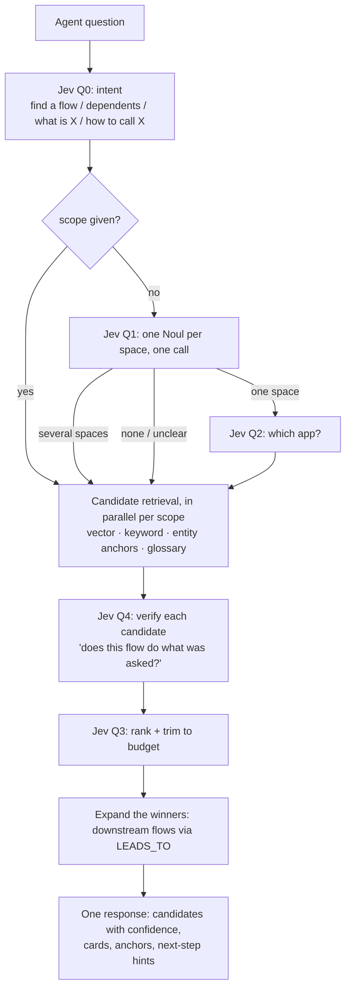

# Retrieval and MCP

How agents get context out of Steno quickly: routing, summary cards, parallel fan-out, the MCP tools, and latency goals.

Part of the [Design Doc](./DESIGN_DOC.md). Status markers: **Decided** · **Proposed** · **Open**.

---

## 1. The speed problem

Rough costs:

| Operation | Cost |
|---|---|
| A graph query over an org-sized graph | **milliseconds** |
| A Jev decision | 70–500 ms |
| **One agent round trip** (the LLM reads the result, thinks, calls again) | **seconds** |

**Round trips dominate.** Contextualized's main slowness came from them. So the design goal is **fewer, better-shaped calls**, not only faster queries. It's a priority from day one, even though correctness comes first.

| Technique | How it cuts round trips | Status |
|---|---|---|
| **Precomputed summary cards** | The expensive understanding happens at ingestion. At query time it's a lookup. | Decided |
| **Route to the right layer** | Jev sends a clear question straight to the space or application, skipping the top-down walk | Decided |
| **Server-side parallel fan-out** | Several spaces are searched in **one call** | Decided |
| **Progressive disclosure** | Every result includes children and edge counts, so the next step is obvious | Proposed |
| **Batch tools** | A whole flow, its code, or a blast radius in one call | Proposed |
| **Token budgets** | Every tool takes `max_tokens`, and Jev Q3 trims the results by relevance | Proposed |

## 2. Search top-down, over data built bottom-up

**Jev is the navigator.** Every navigation step that would normally cost an LLM call (which space, which app, which kind of question, is this the right flow) is a Jev decision instead: typed, calibrated, and done in milliseconds. That's the core of Steno's speed.

- **The client's LLM does the final synthesis.** Steno runs no LLM at query time.
- **Aim for recall over precision.** Returning 5–10 verified candidates with confidence is cheap, and the client's LLM picks among them.

### Finding flows: combining retrieval signals (Proposed)

A question is asked in business language ("how does a client get created?"), while flows are named after code (`POST /v1/clients → ClientController#create`). No single signal bridges that gap, so candidates come from several signals combined, then Jev verifies them:

| Signal | How it works | Catches |
|---|---|---|
| **Flow cards (vector)** | Embeddings of flow cards written in business language | Paraphrased, conceptual questions |
| **Keyword** | A Neo4j **full-text index** over endpoint paths, topic names, symbols, entity and table names | Exact terms: `client.created`, `/v1/clients` |
| **Entity anchors (graph)** | Nouns in the question map to `Entity` / `Table` nodes. The verb maps to an operation (create → `WRITES_TO` insert, a POST, a produced `*.created` event). Candidates = flows that perform that operation on those nodes. | Questions about domain objects, even when card wording differs |
| **Glossary** | Expands org nicknames to graph nodes before searching ("Swing" → its application) | Org-specific vocabulary |

Then:
1. **Jev Q4 verifies every candidate:** one Noul per candidate ("does this flow create a client?"), batched into as few calls as the token budget allows. This gives each candidate an honest confidence.
2. **Jev Q3 ranks and trims** to the tool's `max_tokens`.
3. **The winners are expanded** along `LEADS_TO`, because the answer is often a chain: an API flow that leads to an async onboarding consumer.

**Entity anchors in more detail.** "How does a client get created?":
1. Jev picks the matching `Entity` among candidates from keyword search (`Client`, `ClientDTO`, `ClientContact`), as a Choice.
2. Graph: `Client` `MAPS_TO` table `clients`. Which flows have a step that `WRITES_TO` `clients` with an insert, or produce `client.created`?
3. Those flows become candidates, **even if their cards never use the word "create."**

This is structural retrieval, which embeddings alone can't do. Combined with Jev making every choice and verification cheaply, it's the part of Steno that's genuinely new.

**It gets measured:** a set of questions, each paired with the flows that correctly answer it. Track how often the right flows appear in the top k. It's part of Phase 1's exit criteria.

### Summary cards

**Which nodes get cards:** Organization, Space, Application, Module, **Flow**, Interface, Entity, DataStore / Table, and only the **important** Functions (entry points and shared logic). Most functions get no card, which keeps the count bounded.

| Card | Writer | Input |
|---|---|---|
| **Flow, Application, Space, Org** | A stronger model (e.g. Sonnet-class); to be confirmed by comparing against Haiku on a sample | **Everything retrieved for that node.** For a flow: its trigger, request/response entities, the ordered significant steps, data access, topics, downstream flows' cards, and the code of its significant steps (bounded) |
| **Interface, Entity, Table, Function, Module** | A small model (e.g. Haiku-class) | The node's facts and neighbors |

- **Flow cards determine whether flows can be found**, so they're written in business language and given the full context.
- **Cards are written for two readers:** embeddings and Jev (short, precise, fixed size), and agents (anchors and next steps). Their fixed size is also what keeps **Jev's input bounded** for huge flows (see [Jev §4](./jev.md#4-what-jev-sees-state-design)).
- Cached by the hash of their inputs, and regenerated only when Jev I5 says the meaning changed.
- Written with the **Batch API** (ingestion isn't latency-sensitive, and batch costs 50% less).
- Embedded and stored in Neo4j's **vector index**. No separate vector database.

**Rough cost (to be measured on the first app).** A large application with ~300 entry points has roughly 300 flows, 300 interfaces, and 100 entities, so about **700–1,000 cards**. At ~5k input and ~400 output tokens per card, with the Batch API: about **$3–4 per app with a small model and $7 with a stronger model**, so **~$7k–14k one time for 2,000 applications**. After that, updates only regenerate the cards Jev I5 flags.

## 3. Parallelism

| Kind | Where | How |
|---|---|---|
| **Retrieval** (searching several spaces) | **Server** | Parallel graph and vector queries inside one tool call. No LLM is needed. |
| **Reasoning** (reading code in several places) | **Client** | Claude Code runs tool calls in parallel and supports subagents. Steno can ship a Claude Code skill or agent definition that shows how to fan out. |

An MCP server can't create subagents in the client, and doesn't need to. Most of "send a subagent into each space" is retrieval, and the server does that itself.

## 4. Code access

Code usually **isn't local** to the agent. Facts and flow code cover most needs, but agents still need some raw files: build files (dependencies, versions), config values, READMEs and ADRs, tests (as examples when writing new tests), SQL migrations, Dockerfiles and Helm charts, and anything extraction missed.

**`view_file` and `list_directory` stay as tools.** The question is only **where they read from**:

| Option | Where files come from | Tradeoff |
|---|---|---|
| **A. File store (recommended)** | At ingestion, workers save **every text file of the repo at the ingested commit** into Steno's own storage | **The MCP server never calls the git host.** No git credentials in the MCP server, no rate limits, always consistent with the graph, and **code search across every ingested repo** becomes possible. Costs storage, and Steno holds a full copy of the source (a security consideration). |
| B. Mixed | Store flow code, config, build files, and docs; the git host for everything else | More moving parts |
| C. Git host | Every call goes through the git host API, pinned to the ingested SHA | Rate limits, credentials in the MCP server, latency |

**What "storing" means in option A:**
- **`file_blob`**: file contents keyed by the **git blob SHA** (git's hash of the content). A file that doesn't change between commits has the same blob SHA, so it's stored only once.
- **`repo_file`**: `(repository, path, commit) → blob SHA`. This is what `list_directory` reads.
- Where: Postgres to start (text compresses well), moving to object storage (S3 / MinIO) if volume demands.
- A full-text or trigram index on `file_blob` enables a `search_code` tool across the whole org.

Binary files aren't stored. `view_flow_code` reads the same store, sliced to each step's function.

## 5. MCP tools (Proposed, pending review)

Transport: **MCP over Streamable HTTP**. Every tool accepts `max_tokens`. Every result carries **confidence** and **anchors** (symbol + commit), plus hints for the next call.

### Search and navigation

| Tool | Purpose | Returns | Serves use cases |
|---|---|---|---|
| `search(question, scope?, max_tokens?)` | **The routed entry point.** Jev classifies the question, then Steno searches one scope or fans out across spaces in parallel. Passing `scope` skips routing. | Ranked cards, anchors, the routing decision and its confidence | All |
| `get_node(id \| name, include_children?)` | Progressive disclosure: a node's card plus **a view that depends on its layer** (below) | Card + layer view + next-step hints | Onboarding, planning |
| `glossary(term, space?)` | Look up a term, nickname, or standard | Definition + where it's used | Onboarding |

**What `get_node` returns depends on the node's layer.** A space's overview is simply `get_node` on a Space, so there's no separate overview tool.

| Node | View |
|---|---|
| Organization | Its spaces, with purposes, and the **space-to-space communication map** by transport |
| **Space** | **The "Bloomberg" view:** its applications, data stores, and topics; **ins and outs** (which spaces call in and which it calls out to, grouped by transport); communication within the space; a pointer to its glossary |
| Application | Endpoints, outbound calls, topics produced and consumed, data store access, modules (Service/Library), flows by trigger |
| Flow | Its trigger, summary, significant steps, and the flows it leads to |
| Interface, DataStore, Function, … | Its card, owner, and edges grouped by type |

These views are rollups computed from application-level facts. The future UI renders the same views, so they're built once and serve both agents and people.

### Flows and code

| Tool | Purpose | Returns |
|---|---|---|
| `get_flow(flow_id \| trigger, expand: none\|sync\|all, detail: significant\|all)` | The ordered step tree, stitched across services when expanded | Ordered steps, interactions, sync/async markers |
| `view_flow_code(flow_id, steps?)` | The code for every step of a flow in **one round trip** | Source snippets by step |
| `view_file(repo, path, sha?)` / `list_directory(repo, path, sha?)` | Any file or directory at the ingested commit, from the file store (option A) | File contents / listing |
| `search_code(query, scope?)` | Keyword or regex search across every ingested repository (needs option A) | Matching files and lines, with the owning app and flows |
| `find_symbols(symbols[] \| stack_trace)` | Map stack frames or symbols to functions → flows → triggers → upstream callers | Matching functions and their flows |

### Dependencies and impact

| Tool | Purpose | Returns |
|---|---|---|
| `find_dependents(id, direction: upstream\|downstream, depth?, via?)` | "Who consumes X?" and blast radius. `via` filters by transport. | Dependents grouped by app and space |
| `find_paths(from, to, max_hops?)` | How two things are connected: every chain of flows and interfaces from one node to another | Ordered paths, each hop labeled sync or async |
| `analyze_change(prs[] \| branch \| diff)` | **PR review and CI.** What a change affects, **including related PRs** (see below) | Affected flows, contract changes, consumers, which of them are covered by related PRs, and the order to deploy |
| `get_interface(id)` | **Integration guide.** The contract, request/response entities, how to trigger it, and existing callers as examples | Contract + entities + example callers |

**`find_paths` examples.** `from` and `to` are any two nodes:

| Question | `from` | `to` |
|---|---|---|
| "How does a payroll submission end up writing paychecks?" | `POST /payroll/submit` (endpoint) | `payroll-db.paychecks` (table) |
| "How does employee data reach the tax vendor?" | `employee.updated` (topic) | `TaxVendorAPI` (ExternalSystem) |
| "Is there any connection between users-svc and billing-svc?" | `users-svc` (application) | `billing-svc` (application) |

`find_dependents` answers "what's around X?" in one direction. `find_paths` answers "how does X get to Y?"

### `analyze_change`: analyzing the whole change, not just a diff (Proposed)

A raw diff is too narrow. It misses the PR's context, and the other PRs this change depends on or completes. So the main input is **one or more PR references**, with `branch` or `diff` as fallbacks (e.g. an agent checking its local work before opening a PR).

**Collecting related PRs.** Given one PR, Steno gathers related PRs, deterministically where it can:

| Relationship | How it's detected |
|---|---|
| **Stacked PRs** | The PR's base branch is another open PR's branch |
| **Same ticket** | The same Jira key in the branch name or title across repos, e.g. `PAY-123` in the producer repo and in the consumer repo |
| **Explicit links** | "Depends on #123" in the description, or links in the PR itself |
| **Same Project** (later) | Contextualized knows every PR in a Project, which is the fully holistic view |

**How it's analyzed: a dry-run ingestion.**

1. Run the **same extractors** used for incremental updates on each PR's changed files at its head commit.
2. Compute the **fact diff against main's graph**, but write it to a temporary overlay, never to the main graph.
3. **Combine the overlays** of all related PRs, then analyze them together:
   - "The producer PR changes `order.created`. Consumers A and B are updated by PR #45; **consumer C isn't covered by any PR**."
   - The deploy order: producer before consumers, or the reverse, depending on whether the change is backward compatible.

This reuses the ingestion machinery, so there's no separate analysis engine. It takes seconds to a minute (fetch + extract), which suits CI and PR review. In interactive use it may need to run asynchronously.

### Changes over time (needs the delta store)

| Tool | Purpose | Returns |
|---|---|---|
| `get_changes(scope, since? \| run_id? \| pr?)` | What changed, with before/after for each changed fact | Delta entries (`before` / `after`) |

## 6. Latency targets (Proposed)

| Metric | Target |
|---|---|
| Graph-only tools (`get_node`, `find_dependents`, `get_flow`) | p95 < 300 ms |
| `search` with Jev routing and fan-out | p95 < 1.5 s |
| Typical question answered in | ≤ 3 tool calls |

To be validated against real usage. Tool calls and latencies are logged so round trips can be measured, not guessed.
