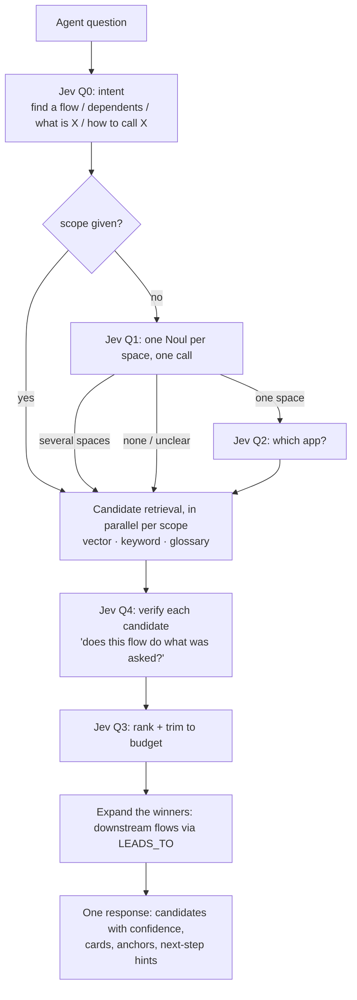

# Retrieval and MCP

How agents get context out of Steno quickly: routing, summary cards, parallel fan-out, the MCP tools, and latency goals.

Part of the [Design Doc](./DESIGN_DOC.md). Status markers: **Decided** · **Proposed** · **Open**.

---

## 1. The speed problem

Rough costs:

| Operation | Cost |
|---|---|
| A graph query over an org-sized graph | **milliseconds** |
| A Jev decision | 70–500 ms |
| **One agent round trip** (the LLM reads the result, thinks, calls again) | **seconds** |

**Round trips dominate.** Contextualized's main slowness came from them. So the design goal is **fewer, better-shaped calls**, not only faster queries. It's a priority from day one, even though correctness comes first.

| Technique | How it cuts round trips | Status |
|---|---|---|
| **Precomputed summary cards** | The expensive understanding happens at ingestion. At query time it's a lookup. | Decided |
| **Route to the right layer** | Jev sends a clear question straight to the space or application, skipping the top-down walk | Decided |
| **Server-side parallel fan-out** | Several spaces are searched in **one call** | Decided |
| **Progressive disclosure** | Every result includes children and edge counts, so the next step is obvious | Decided |
| **Batch tools** | A whole flow, its code, or a blast radius in one call | Decided |
| **Token budgets** | Every tool takes `max_tokens`, and Jev Q3 trims the results by relevance | Decided |

## 2. Search top-down, over data built bottom-up

**Jev is the navigator.** Every navigation step that would normally cost an LLM call (which space, which app, which kind of question, is this the right flow) is a Jev decision instead: typed, calibrated, and done in milliseconds. That's the core of Steno's speed.



- **The client's LLM does the final synthesis.** Steno runs no LLM at query time.
- **Semantic search proposes; Jev verifies and ranks.** Jev never decides alone what's excluded:
  - **A global search runs in parallel with routing.** Vector and keyword search across the whole architecture graph run alongside the routed search, and the results are merged. If routing picks the wrong space, the global search still finds the flow.
  - **Soft routing:** when Q1's confidences are close together, fan out wider instead of trusting the top pick. The beam always keeps at least 2 branches.
  - **Jev ranks, and only prunes when highly confident.** Lower-confidence candidates stay in the results, lower down and marked.
  - **Every Jev decision can be switched off**, falling back to ranking by embedding score. Logs and the question → flow set show whether each decision helps.
- **Aim for recall over precision.** Returning 5–10 verified candidates with confidence is cheap, and the client's LLM picks among them.

### Finding flows: combining retrieval signals (Decided)

A question is asked in business language ("how does a client get created?"), while flows are named after code (`POST /v1/clients → ClientController#create`). No single signal bridges that gap, so candidates come from several signals combined, then Jev verifies them:

| Signal | How it works | Catches |
|---|---|---|
| **Flow cards (vector)** | Embeddings of flow cards: the deterministic signature plus the LLM-written purpose and narrative | Paraphrased, conceptual questions |
| **Keyword** | A Neo4j **full-text index** over endpoint paths, topic names, symbols, entity and table names | Exact terms: `client.created`, `/v1/clients` |
| **Entity anchors (graph)** *(deferred, later optimization)* | Nouns in the question map to `Entity` / `Table` nodes. The verb maps to an operation (create → `WRITES_TO` insert, a POST, a produced `*.created` event). Candidates = flows that perform that operation on those nodes. | Questions about domain objects, even when card wording differs |
| **Glossary** | Expands org nicknames to graph nodes before searching ("Swing" → its application) | Org-specific vocabulary |

Then:
1. **Jev Q4 verifies every candidate:** one Noul per candidate ("does this flow create a client?"), batched into as few calls as the token budget allows. This gives each candidate an honest confidence.
2. **Jev Q3 ranks and trims** to the tool's `max_tokens`.
3. **The winners are expanded** along `LEADS_TO`, because the answer is often a chain: an API flow that leads to an async onboarding consumer.

**Entity anchors in more detail.** "How does a client get created?":
1. **At ingestion**, Jev I9 tags every flow with a primary entity and an operation (create / read / update / delete / process / sync / notify / report).
2. **At query time**, Jev picks the entity (Q2b: `Client` among `Client`, `ClientDTO`, `ClientContact`) and the operation (Q0: *create*).
3. An index lookup returns the flows tagged (`Client`, create), cross-checked against the graph (`WRITES_TO clients` with an insert, or producing `client.created`).
4. Those flows become candidates, **even if their cards never use the word "create."**

It's one signal among four. Q0 decides when it applies (questions about domain objects), and it's not used otherwise.

**Status: deferred.** Phase 1 uses routing plus cards (vector), keyword, and glossary. Entity anchors are a later optimization, once measurements show where plain retrieval falls short.

This is structural retrieval, which embeddings alone can't do. Combined with Jev making every choice and verification cheaply, it's the part of Steno that's genuinely new.

**It gets measured:** a set of questions, each paired with the flows that correctly answer it. Track how often the right flows appear in the top k. It's part of Phase 1's exit criteria.

### Summary cards (Decided)

**Where cards live:** as **properties on the node they describe** (`card`, `card_hash`, `card_embedding`), not as separate nodes. Every node with a card also gets a shared `:Searchable` label, so **one** vector index and one full-text index cover all of them.

| Node | Card contents | Written by |
|---|---|---|
| **Flow** | Trigger, purpose, narrative steps, what it touches, what it leads to, business context (later), source. See the [flow card](./knowledge-graph.md#flow-levels-and-the-flow-card-decided). | Deterministic signature + **LLM purpose and narrative for every flow** at initial ingestion |
| **Application, Space, Organization** | Purpose, key flows and interfaces, ins and outs | LLM (few nodes, high value, and routing depends on them) |
| **Interface, Entity, Table, Module** | Facts and neighbors | Deterministic template |

- **Why every flow gets an LLM purpose:** declared summaries are often missing or vague, and without a real purpose semantic search has nothing meaningful to match.
- **Keeping it affordable at scale:** a small model by default, the Batch API, and **prompt caching** (flows in one app share a cached prefix: the app card, entities, conventions).
- **On re-ingestion:** deterministic parts are rebuilt for free. **Jev I5** decides from the old purpose and narrative plus the fact diff whether they're still accurate; the LLM regenerates them only if not.
- **Cards are written for two readers:** embeddings and Jev (short, precise, bounded in size), and agents (sources and next steps). Their bounded size keeps **Jev's input bounded** for huge flows (see [Jev §4](./jev.md#4-what-jev-sees-state-design)).

### How embeddings are stored and searched (Decided)

**Neo4j stores and searches vectors; Steno computes them.** Embedding happens in Steno's ingestion workers (and, for questions, in the MCP server), so Steno controls the model (including a local one if data policy requires it), batching, caching, and retries.

1. **Setup:** one vector index on `(:Searchable).card_embedding` (dimensions must match the model; cosine similarity) and one full-text index on `(:Searchable).card` and `.name` for keyword search. A vector index covers one label and one property, which is why every carded node also gets the `:Searchable` label.
2. **Ingestion (cards stage):** skip cards whose `card_hash` hasn't changed, embed the rest in one batch, and write each vector onto its node with `db.create.setNodeVectorProperty` (Neo4j's compact vector storage), along with `card_embedding_model`.
3. **Query:** embed the question with **the same model**, call `db.index.vector.queryNodes`, over-fetch, then filter by the spaces Jev routed to (the filter applies after the nearest-neighbor search unless the Neo4j version supports filtered vector search).

**Changing the embedding model** means re-embedding every card and recreating the index (dimensions usually change). `card_embedding_model` on each node records which model produced its vector.

### Cost and time: measure before generating (Decided)

Phase 1 starts with a **dry run that writes no LLM cards**, to see the real numbers before spending:

1. **Deterministic ingestion only** for one application: clone, dependencies, parsing, resolution, flow derivation, graph write, signature-only flow cards.
2. **Ingestion report:**
   - **time per stage** (clone, dependency fetch, parse, assemble, derive flows, write)
   - **graph size**: nodes and edges by label, number of flows, and business vs. technical flows
   - **projected LLM cost**: the input tokens every flow's purpose and narrative *would* need (token counting, not generation), times each model's price, with and without prompt caching
3. **A sample:** purposes and narratives for ~50 flows with a small and a stronger model. Compare retrieval quality on the question → flow set, and against signature-only cards.
4. **Extrapolate to the org:** per-app numbers × the org's app count, scaled by app size (endpoint count, lines of code).
5. **Ongoing cost:** merges per day × flows touched per merge × the share I5 flags for regeneration.

The dry run gives the real cost of writing every flow's purpose and narrative, before any spend, and the levers to lower it (model, batch, caching) are compared on real numbers.

## 3. Parallelism

| Kind | Where | How |
|---|---|---|
| **Retrieval** (searching several spaces) | **Server** | Parallel graph and vector queries inside one tool call. No LLM is needed. |
| **Reasoning** (reading code in several places) | **Client** | Claude Code runs tool calls in parallel and supports subagents. Steno can ship a Claude Code skill or agent definition that shows how to fan out. |

An MCP server can't create subagents in the client, and doesn't need to. Most of "send a subagent into each space" is retrieval, and the server does that itself.

## 4. Code access (Decided: no stored file contents)

Code usually **isn't local** to the agent. Steno **stores no file contents**. Every code tool reads from the **git host API at the ingested commit**, so what the agent sees always matches the graph.

| Tool | What it does |
|---|---|
| `view_flow_code(flow_id, detail?)` | The source of a flow's functions **in order, across all its files, in one call**. It uses the flow's stored function list and line ranges to fetch only the files it needs (in parallel) and slices each function out, with a citation on each. `detail`: the significant steps only (default), or every touched function. |
| `view_file` / `list_directory` | Files **not covered by any flow**: `build.gradle`, `application.yml`, READMEs, tests. Rarely needed. |

- An in-memory cache in the MCP server absorbs repeated reads.
- The cost: git credentials live in the MCP server, and there's some latency and rate-limit risk. Revisit only if measurements show a problem.

## 5. MCP tools (Decided)

Transport: **MCP over Streamable HTTP**. Every tool accepts `max_tokens`. Every result carries **confidence**, **citations** (below), and hints for the next call.

### Citations (Decided: part of V1)

Every fact already records its source (repo, symbol, commit) and every call site its line, so each result **cites where its claims come from**, with a clickable link:

```json
"citations": [{
  "claim": "writes clients (insert)",
  "space": "Onboarding", "app": "users-svc", "repo": "microservices",
  "module": "services/users", "file": "src/main/java/.../ClientService.java",
  "lines": "57", "commit": "a1b2c3d",
  "url": "https://<git host>/.../ClientService.java?at=a1b2c3d#lines-57"
}],
"searched": ["space:Onboarding", "space:Identity"]
```

- **Cite each claim** (an effect, a step, a contract), not every file touched. For a flow, that's its entry function plus one citation per effect.
- **`searched`** lists the scopes the answer came from, so the consumer knows what was and wasn't looked at.
- The consumer (agent or person) can always go and check the exact place the claim came from.

### Search and navigation

| Tool | Purpose | Returns | Serves use cases |
|---|---|---|---|
| `search(question, scope?, max_tokens?)` | **The routed entry point.** Jev classifies the question, then Steno searches one scope or fans out across spaces in parallel. Passing `scope` skips routing. | Ranked cards, anchors, the routing decision and its confidence | All |
| `get_node(id \| name, include_children?)` | Progressive disclosure: a node's card plus **a view that depends on its layer** (below) | Card + layer view + next-step hints | Onboarding, planning |
| `glossary(term, space?)` | Look up a term, nickname, or standard | Definition + where it's used | Onboarding |

**What `get_node` returns depends on the node's layer.** A space's overview is simply `get_node` on a Space, so there's no separate overview tool.

| Node | View |
|---|---|
| Organization | Its spaces, with purposes, and the **space-to-space communication map** by transport |
| **Space** | **The "Bloomberg" view:** its applications, data stores, and topics; **ins and outs** (which spaces call in and which it calls out to, grouped by transport); communication within the space; a pointer to its glossary |
| Application | Endpoints, outbound calls, topics produced and consumed, data store access, modules (Service/Library), flows by trigger |
| Flow | Its trigger, summary, significant steps, and the flows it leads to |
| Interface, DataStore, Table, … | Its card, owner, and edges grouped by type |

These views are rollups computed from application-level facts. The future UI renders the same views, so they're built once and serve both agents and people.

### Flows and code

| Tool | Purpose | Returns |
|---|---|---|
| `get_flow(flow_id \| trigger, expand: none\|sync\|all, detail: significant\|all)` | The ordered step tree, stitched across services when expanded; `detail: all` returns the full trace | Ordered steps (or trace entries) with file and lines, interactions, sync/async markers, and the flows each cross-app step leads to |
| `view_flow_code(flow_id, steps?)` | The code for every step of a flow in **one round trip**, read from the git host at the ingested commit using the trace's file and lines | Source snippets by step |
| `view_file(repo, path, sha?)` / `list_directory(repo, path, sha?)` | Files not covered by any flow, from the git host at the ingested commit | File contents / listing |
| `find_symbols(symbols[] \| stack_trace)` | Map stack frames or symbols to the flows whose traces contain them → triggers → upstream callers | Matching trace entries and their flows |

**Following a flow across spaces.** An agent doesn't need any repository checked out to follow behavior through the org. `get_flow(A)` returns A's steps and says that step 3 calls `POST /accounts`, which starts Flow B in another application and space. `view_flow_code(A, [2, 3])` shows the code for those steps, read from the git host. `get_flow(B)` continues on the other side. Interface nodes are the bridges, and each flow's trace tells the agent which few functions out of thousands to read. Steno only reads code; it never changes it.

### Dependencies and impact

| Tool | Purpose | Returns |
|---|---|---|
| `find_dependents(id, direction: upstream\|downstream, depth?, via?)` | "Who consumes X?" and blast radius. `via` filters by transport. | Dependents grouped by app and space |
| `find_paths(from, to, max_hops?)` | How two things are connected: every chain of flows and interfaces from one node to another | Ordered paths, each hop labeled sync or async |
| `analyze_change(prs[] \| branch \| diff)` | **PR review and CI.** What a change affects, **including related PRs** (see below) | Affected flows, contract changes, consumers, which of them are covered by related PRs, and the order to deploy |
| `get_interface(id)` | **Integration guide.** The contract, request/response entities, how to trigger it, and existing callers as examples | Contract + entities + example callers |

**`find_paths` examples.** `from` and `to` are any two nodes:

| Question | `from` | `to` |
|---|---|---|
| "How does a payroll submission end up writing paychecks?" | `POST /payroll/submit` (endpoint) | `payroll-db.paychecks` (table) |
| "How does employee data reach the tax vendor?" | `employee.updated` (topic) | `TaxVendorAPI` (ExternalSystem) |
| "Is there any connection between users-svc and billing-svc?" | `users-svc` (application) | `billing-svc` (application) |

`find_dependents` answers "what's around X?" in one direction. `find_paths` answers "how does X get to Y?"

### `analyze_change`: analyzing the whole change, not just a diff (Decided)

A raw diff is too narrow. It misses the PR's context, and the other PRs this change depends on or completes. So the main input is **one or more PR references**, with `branch` or `diff` as fallbacks (e.g. an agent checking its local work before opening a PR).

**Collecting related PRs.** Given one PR, Steno gathers related PRs, deterministically where it can:

| Relationship | How it's detected |
|---|---|
| **Stacked PRs** | The PR's base branch is another open PR's branch |
| **Same ticket** | The same Jira key in the branch name or title across repos, e.g. `PAY-123` in the producer repo and in the consumer repo |
| **Explicit links** | "Depends on #123" in the description, or links in the PR itself |
| **Same Project** (later) | Contextualized knows every PR in a Project, which is the fully holistic view |

**How it's analyzed: a dry-run ingestion.**

1. Run the **same ingestion** used nightly, as a dry run, on each PR's head commit.
2. Compute the **fact diff against main's graph**, but write it to a temporary overlay, never to the main graph.
3. **Combine the overlays** of all related PRs, then analyze them together:
   - "The producer PR changes `order.created`. Consumers A and B are updated by PR #45; **consumer C isn't covered by any PR**."
   - The deploy order: producer before consumers, or the reverse, depending on whether the change is backward compatible.

This reuses the ingestion machinery, so there's no separate analysis engine. It takes seconds to a few minutes (a whole-repository analysis), which suits CI and PR review. In interactive use it may need to run asynchronously.

### Changes over time (needs the delta store)

| Tool | Purpose | Returns |
|---|---|---|
| `get_changes(scope, since? \| run_id? \| pr?)` | What changed, with before/after for each changed fact | Delta entries (`before` / `after`) |

## 6. Latency targets (Proposed)

| Metric | Target |
|---|---|
| Graph-only tools (`get_node`, `find_dependents`, `get_flow`) | p95 < 300 ms |
| `search` with Jev routing and fan-out | p95 < 1.5 s |
| Typical question answered in | ≤ 3 tool calls |

To be validated against real usage. Every tool call is logged in `tool_call` (grouped by session), so round trips per question and latencies are measured, not guessed.
